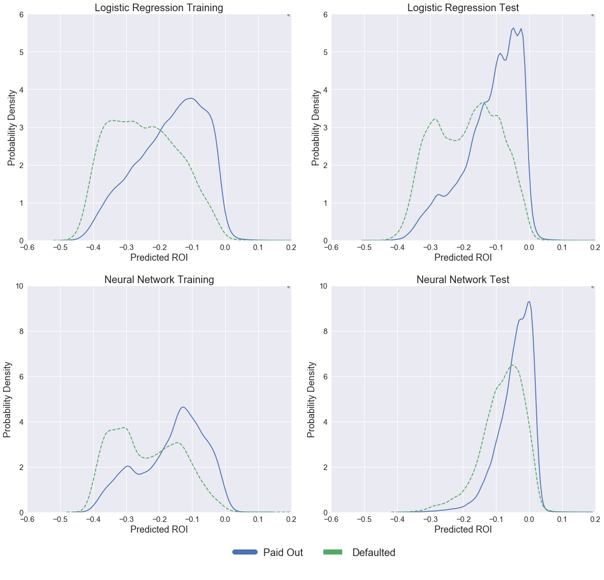
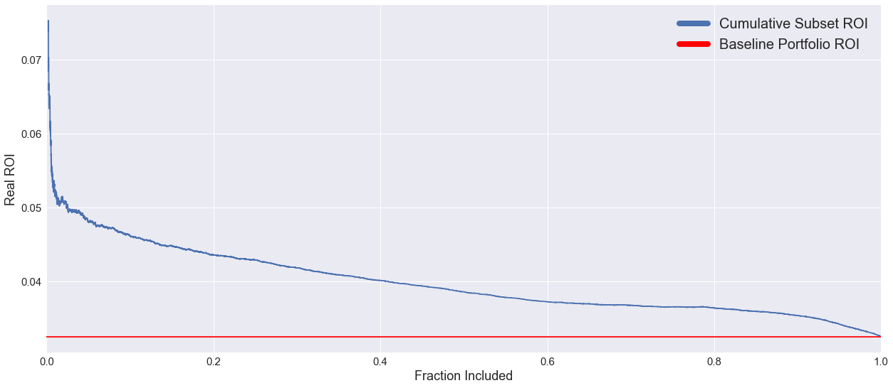

## Market Efficiency

We would expect the loan market to be very efficient, and to price a borrower's risk into their loan. We know this is the case, since riskier borrowers (by loan grade) need to pay higher interest rates to qualify for credit. Because our ROI formulation represents a balance between a borrowers risk of default, and the interest rate we are charging them, a fully efficient market wouldn't present us with opportunities to 'over-perform' since these two competing attributes would be expected to work against each other such that every loan had a similar predicted ROI. 

Lending Club claims to have been founded on the premise that a peer-to-peer lending model would work to make small loans more efficient by making them accessible to large investors. Large institutional investors increasingly use the Lending Club platform as a way to diversify their investments, making this a tough market place to compete in as an individual. We would therefore expect the ROI distributions of loans that defaulted and loans that paid off succesfully to show significant overlap, making finding an investment strategy to outperform the market a tough proposition.

## Formulating Return on Investment

Having used several different models to assign probabilities of default to the loans in our training and test sets, we needed to incorporate these probabilities into our investment strategy. We decided to use these probabilities of default to calculate a Return on Investment (ROI) for every loan in the dataset. By only investing in the loans with the best predicted ROI, we would hope to achieve stronger returns than the broader market. 

Our formula for expected ROI was:

$$ ROI_{P}=\frac{(1+I)A(1-P_d) + \alpha P_d R - A}{A} $$

With: 
* $A$   - loan amount
* $P_d$ - probability of Default (assessed by our models)
* $I$   - interest rate charged on the loan
* $R$   - expected return should a loan default
* $\alpha$ -default penalty term

The predicted ROI is the expected return from all of our loans, so in the case when we don't expect loans to default (probability - $1-P_d$) we would receive $(1+I)A$ from the borrower. Should the borrower default we would expect to still receive some money from them: defaults rarely happen before any payments have been made, and because of charge-offs and other measures, investors get back an average of 89 cents on the dollar from their distressed loans. 

Since there is significant uncertainty associated with $R$, some defaulted loans pay back almost fully while others return close to nothing, we want to bias our model away from these loans so we apply a penalty term $\alpha$ (between 0 and 1) which we will tune on our training set to help optimize our predictive ranking.

Using this formula we are able to predict ROI for every loan in our training and test sets. We then rank the loans according to predicted ROI, and invest only in the top tranche. Plots of initially predicted ROI across loans that eventually paid off or defaulted are shown below for both the Logistic Regression model and our Neural Net. The Logistic Regression model achieved a higher AUC score compared with our Neural Net, and it seems from observing the $P_d$ and $ROI_P$ distributions returned by both models that the Logistics Regression is doing a better job ranking the loans. For this reason we decided to take the Logistic Regression forwards as our final model. 

## Comparison of Models

Using this formula we are able to predict ROI for every loan in our training and test sets. We then rank the loans according to predicted ROI, and invest only in the top tranche. Plots of initially predicted ROI across loans that eventually paid off or defaulted are shown below for both the Logistic Regression model and our Neural Net. The Logistic Regression model achieved a higher AUC score compared with our Neural Net, and it seems from observing the $P_d$ and $ROI_P$ distributions returned by both models that the Logistics Regression is doing a better job ranking the loans. For this reason we decided to take the Logistic Regression forwards as our final model.

## Plot of Predicted ROI for Neural Net and Logistic Regression Models

## Tuning Return on Investment Predictions - Penalty Term

The penalty parameter in our ROI prediction model was an important parameter to tune, since it determined the extent to which our model was biased against loans that were assessed to have a higher probability of default, but also offered significant potential pay-off. We decided to rank our loans based on this predicted ROI. Our data included information on all the payments made by borrowers having received a loan, so we used this information to calculate the real ROI for all our loans, so as to determine the relative performance of the subset we would select based on our predictions.

We used information on payments made by the borrowers to formulate a loan's real ROI:

$$ROI_R = A\left[\left(\dfrac{P}{A}\right)^{\dfrac{1}{term}} - 1\right]$$

To normalise this for the size of the loan, across a subset of selected loans, we suggested that:

$$ROI_{R} = \dfrac{\sum A\left(\left(\dfrac{P}{A}\right)^{\dfrac{1}{term}} - 1\right)}{\sum A}$$

In this formula, we have:
* $A$   - loan amount
* $P$ - probability of Default (assessed by our models)
* $I$   - interest rate charged on the loan
* $term$ - repayment period of the loan

For $term$ we take the actual point at which the loan was repayed, in order to account for the time value of money. A lot of loans had nominal terms of several years but were repayed very quickly, sometimes even within a month. Taking this into account was essential to understanding the true performance of the loans.

Doing this allowed us to evaluate the performance of the entire portfolio as well as a subset of it. We decided to create strategy curves for our ranked dataframe of loans. A strategy curve plots the real ROI of all the loans being considered in a certain proportion of the ranked loan-set as we work from best to worst. In an ideal curve, we would expect the real ROI to be relatively high for the upper tranche of loans and then for it to decrease to the portfolio baseline value as the proportion of loans increases from just the best predicted ones until the full loan-set is included. 

We tuned the penalty term ($\alpha$) in our ROI prediction model, controlling the amount of money we would expect a defaulted loan to return. By tuning this parameter (between 0 - assume all defaults return no money, and 1.25 - assuming defaulted loans returned more than they were worth) on the training set, and considering which strategy curve would best represent an optimal ranking of the loans, we were able to make ROI predictions on our test set, to rank the test loans, and to create a strategy curve for this set, representative of our ability to succesfully rank loans according to their investment value.

The plot below shows our strategy curves for the training set as the parameter $\alpha$ in our predicted ROI formulation was varied. It is clear that as $\alpha$ increases towards 1, the value at which we would expect our model to be most accurate, since at this rate we fully account for the difference in repayment rates between defaulted and non-defaulted loans, our loan ranking improves. We see this from the fact that the strategy curves tend towards being monotonically decreasing.

Since using a value of $\alpha$ larger than unity makes no sense, even though it gives us a better strategy curve than with $\alpha$ equal to one on our training set, so we decided to use $\alpha$ of one going forwards to simulate our test data. 

## Plot of Strategy Curves as Penalty Term is Varied - Training Set

## Plot of Strategy Curve Final Model - Test Set

With this value of $\alpha$, our curve for the test data is decreasingly monotonic, indicative of the fact that our predictions for loan performance match up really nicely with the actual performance of those loans. This curve forms the basis of our investment strategy, with a certain amount of money available to an investor, if they were to buy all the loans in order of $ROI_P$ rank predicted by our Logistic Regression model, they would almost certainly outperform the market since we have shown our ranking system to be succesful. 

## Plot of Loan ROI against Rank 

The plots above, showing Real ROI against rank, show that the best ranked loans (zero on our axis) outperformed the whole portfolio while the worst ranked loans (one on our axis) underperformed the portfolio. These results are consistent with the decreasingly monotonic nature of our strategy curves. There is a large region through the middle of our ranked list for both the training and the test set where loan's track the average performance of the broader set, showing that our model doesn't just differentiate between good and bad loans, but also between good and less good loans. 

## Plot of Portfolio ROI: Random Selection vs. Rank Selection

Above are plots showing how the real ROI of loans varied with percentile rank and how our selected portfolios performed compared to portfolios of the same size randomly drawn from the dataset by bootstrapping. We decided to implement our strategy with various size investment portfolios, assuming that the strategies we developed would be similar to those developed by institutional investors seeking to invest on the Lending club platform as well as high net-worth individuals. 

This figure represented 3.9% of the total loan amount available in both our training and test sets. We bootstrapped from the underlying data 500 times to create randomly selected portfolios of the same size, to compare the performance of the loans selected by the Logistic Regression against a benchmark. The plot of bootstrapped portfolio performance against our model performance clearly shows that our performance was not due to chance: our portfolio consistently outperformed all random sets put together. 

## Comparing Portfolios of Various Sizes against the Market

<table border="1" class="dataframe">
  <thead>
    <tr style="text-align: right;">
      <th></th>
      <th>$500k ROI</th>
      <th>$5m ROI</th>
      <th>$200m ROI</th>
      <th>Baseline ROI</th>
    </tr>
  </thead>
  <tbody>
    <tr>
      <th>Training Set</th>
      <td>0.108</td>
      <td>0.089</td>
      <td>0.068</td>
      <td>0.054</td>
    </tr>
    <tr>
      <th>Test Set</th>
      <td>0.071</td>
      <td>0.064</td>
      <td>0.049</td>
      <td>0.033</td>
    </tr>
  </tbody>
</table>

This table compares the returns achieved by selecting portfolios of certain sizes from our ranked list of loans against broader market performance. As is expected, subset performance tends towards baseline performance as the size of our investment budget increases.

**Analysis**

These results clearly show that our model was able to select a subset of loans, with various portfolio sizes, that consistently outperformed the market. The performances of these models was also so significantly beyond results obtained through random selection of loans from the data that it was clear our performance wasn't achieved due to chance. These models didn't seek to address the issue of discrimination, we deliberately restricted our subset of predictors to remove those we believed would correlate strongly with protected characteristics, and decided to tackle discrimination later on through statistical parity adjustment.

