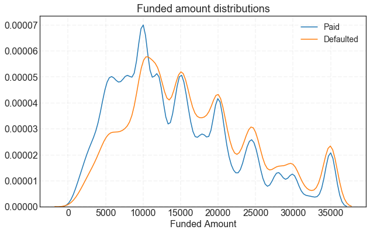
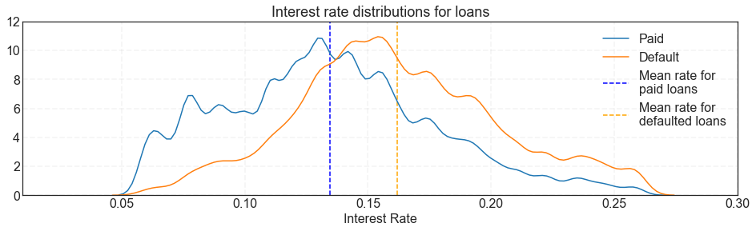
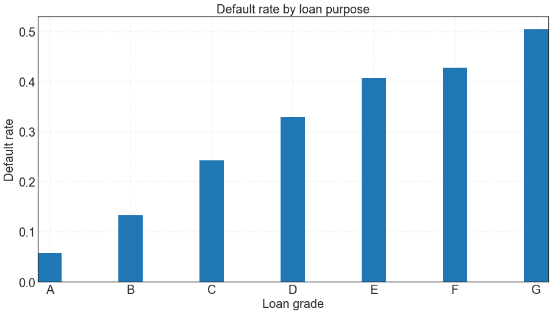
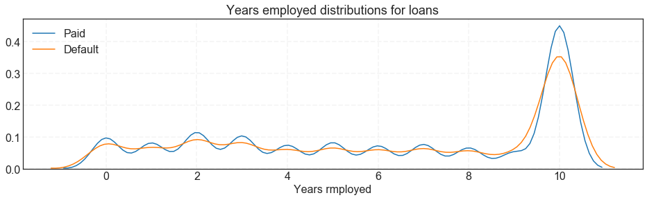
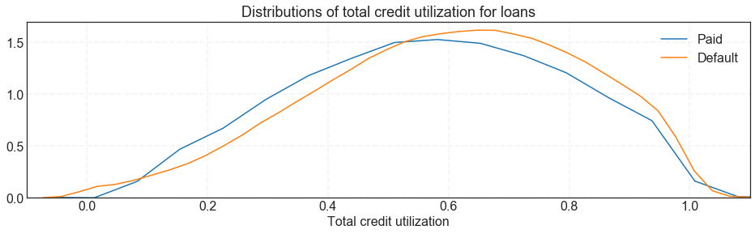
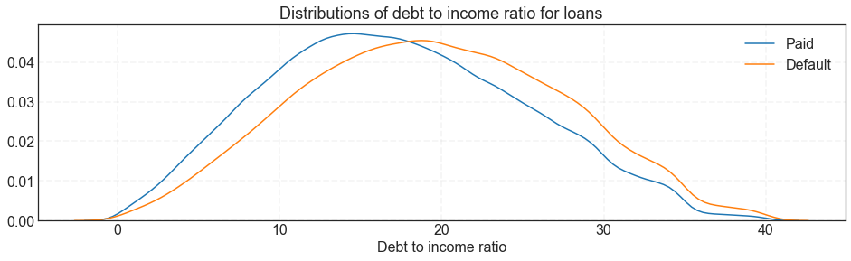
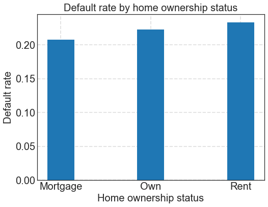

We began by looking at the accepted loan data from the years 2013 and 2014. We did not look at loan data prior to 2013 because Lending Club [changed its underwriting policy in late 2012](https://www.lendacademy.com/lending-club-underwriting-changes/), which "removed the highest risk borrowers that were previously being approved and... added back in the best borrowers from previously declined populations." Thus, we did not want the loan acceptance policies/strategies from 2012 and before to influence our models, since they are not representative of the way Lending Club accepts loans today.

    /Users/bhavenpatel/anaconda3/lib/python3.6/site-packages/IPython/core/interactiveshell.py:2785: DtypeWarning: Columns (47,123,124,125,128,129,130,133) have mixed types. Specify dtype option on import or set low_memory=False.
      interactivity=interactivity, compiler=compiler, result=result)
    /Users/bhavenpatel/anaconda3/lib/python3.6/site-packages/IPython/core/interactiveshell.py:2785: DtypeWarning: Columns (19) have mixed types. Specify dtype option on import or set low_memory=False.
      interactivity=interactivity, compiler=compiler, result=result)

    (134814, 145)
    (235629, 145)

    145
    145

<table border="1" class="dataframe">
  <thead>
    <tr style="text-align: right;">
      <th></th>
      <th>id</th>
      <th>member_id</th>
      <th>loan_amnt</th>
      <th>funded_amnt</th>
      <th>funded_amnt_inv</th>
      <th>term</th>
      <th>int_rate</th>
      <th>installment</th>
      <th>grade</th>
      <th>sub_grade</th>
      <th>emp_title</th>
      <th>emp_length</th>
      <th>home_ownership</th>
      <th>annual_inc</th>
      <th>verification_status</th>
      <th>issue_d</th>
      <th>loan_status</th>
      <th>pymnt_plan</th>
      <th>url</th>
      <th>desc</th>
      <th>purpose</th>
      <th>title</th>
      <th>zip_code</th>
      <th>addr_state</th>
      <th>dti</th>
      <th>delinq_2yrs</th>
      <th>earliest_cr_line</th>
      <th>inq_last_6mths</th>
      <th>mths_since_last_delinq</th>
      <th>mths_since_last_record</th>
      <th>open_acc</th>
      <th>pub_rec</th>
      <th>revol_bal</th>
      <th>revol_util</th>
      <th>total_acc</th>
      <th>initial_list_status</th>
      <th>out_prncp</th>
      <th>out_prncp_inv</th>
      <th>total_pymnt</th>
      <th>total_pymnt_inv</th>
      <th>total_rec_prncp</th>
      <th>total_rec_int</th>
      <th>total_rec_late_fee</th>
      <th>recoveries</th>
      <th>collection_recovery_fee</th>
      <th>last_pymnt_d</th>
      <th>last_pymnt_amnt</th>
      <th>next_pymnt_d</th>
      <th>last_credit_pull_d</th>
      <th>collections_12_mths_ex_med</th>
      <th>mths_since_last_major_derog</th>
      <th>policy_code</th>
      <th>application_type</th>
      <th>annual_inc_joint</th>
      <th>dti_joint</th>
      <th>verification_status_joint</th>
      <th>acc_now_delinq</th>
      <th>tot_coll_amt</th>
      <th>tot_cur_bal</th>
      <th>open_acc_6m</th>
      <th>open_act_il</th>
      <th>open_il_12m</th>
      <th>open_il_24m</th>
      <th>mths_since_rcnt_il</th>
      <th>total_bal_il</th>
      <th>il_util</th>
      <th>open_rv_12m</th>
      <th>open_rv_24m</th>
      <th>max_bal_bc</th>
      <th>all_util</th>
      <th>total_rev_hi_lim</th>
      <th>inq_fi</th>
      <th>total_cu_tl</th>
      <th>inq_last_12m</th>
      <th>acc_open_past_24mths</th>
      <th>avg_cur_bal</th>
      <th>bc_open_to_buy</th>
      <th>bc_util</th>
      <th>chargeoff_within_12_mths</th>
      <th>delinq_amnt</th>
      <th>mo_sin_old_il_acct</th>
      <th>mo_sin_old_rev_tl_op</th>
      <th>mo_sin_rcnt_rev_tl_op</th>
      <th>mo_sin_rcnt_tl</th>
      <th>mort_acc</th>
      <th>mths_since_recent_bc</th>
      <th>mths_since_recent_bc_dlq</th>
      <th>mths_since_recent_inq</th>
      <th>mths_since_recent_revol_delinq</th>
      <th>num_accts_ever_120_pd</th>
      <th>num_actv_bc_tl</th>
      <th>num_actv_rev_tl</th>
      <th>num_bc_sats</th>
      <th>num_bc_tl</th>
      <th>num_il_tl</th>
      <th>num_op_rev_tl</th>
      <th>num_rev_accts</th>
      <th>num_rev_tl_bal_gt_0</th>
      <th>num_sats</th>
      <th>num_tl_120dpd_2m</th>
      <th>num_tl_30dpd</th>
      <th>num_tl_90g_dpd_24m</th>
      <th>num_tl_op_past_12m</th>
      <th>pct_tl_nvr_dlq</th>
      <th>percent_bc_gt_75</th>
      <th>pub_rec_bankruptcies</th>
      <th>tax_liens</th>
      <th>tot_hi_cred_lim</th>
      <th>total_bal_ex_mort</th>
      <th>total_bc_limit</th>
      <th>total_il_high_credit_limit</th>
      <th>revol_bal_joint</th>
      <th>sec_app_earliest_cr_line</th>
      <th>sec_app_inq_last_6mths</th>
      <th>sec_app_mort_acc</th>
      <th>sec_app_open_acc</th>
      <th>sec_app_revol_util</th>
      <th>sec_app_open_act_il</th>
      <th>sec_app_num_rev_accts</th>
      <th>sec_app_chargeoff_within_12_mths</th>
      <th>sec_app_collections_12_mths_ex_med</th>
      <th>sec_app_mths_since_last_major_derog</th>
      <th>hardship_flag</th>
      <th>hardship_type</th>
      <th>hardship_reason</th>
      <th>hardship_status</th>
      <th>deferral_term</th>
      <th>hardship_amount</th>
      <th>hardship_start_date</th>
      <th>hardship_end_date</th>
      <th>payment_plan_start_date</th>
      <th>hardship_length</th>
      <th>hardship_dpd</th>
      <th>hardship_loan_status</th>
      <th>orig_projected_additional_accrued_interest</th>
      <th>hardship_payoff_balance_amount</th>
      <th>hardship_last_payment_amount</th>
      <th>disbursement_method</th>
      <th>debt_settlement_flag</th>
      <th>debt_settlement_flag_date</th>
      <th>settlement_status</th>
      <th>settlement_date</th>
      <th>settlement_amount</th>
      <th>settlement_percentage</th>
      <th>settlement_term</th>
      <th>Default</th>
    </tr>
  </thead>
  <tbody>
    <tr>
      <th>0</th>
      <td>NaN</td>
      <td>NaN</td>
      <td>10000</td>
      <td>10000</td>
      <td>10000.0</td>
      <td>36 months</td>
      <td>9.67%</td>
      <td>321.13</td>
      <td>B</td>
      <td>B1</td>
      <td>Registered Nurse</td>
      <td>7 years</td>
      <td>MORTGAGE</td>
      <td>102000.0</td>
      <td>Not Verified</td>
      <td>Dec-13</td>
      <td>Fully Paid</td>
      <td>n</td>
      <td>NaN</td>
      <td>NaN</td>
      <td>debt_consolidation</td>
      <td>Clean Up</td>
      <td>027xx</td>
      <td>MA</td>
      <td>15.55</td>
      <td>2</td>
      <td>Oct-89</td>
      <td>0</td>
      <td>11.0</td>
      <td>NaN</td>
      <td>9</td>
      <td>0</td>
      <td>9912</td>
      <td>44.40%</td>
      <td>22</td>
      <td>f</td>
      <td>0.0</td>
      <td>0.0</td>
      <td>11560.462180</td>
      <td>11560.46</td>
      <td>10000.0</td>
      <td>1560.46</td>
      <td>0.0</td>
      <td>0.0</td>
      <td>0.0</td>
      <td>Jan-17</td>
      <td>320.91</td>
      <td>NaN</td>
      <td>Dec-16</td>
      <td>0</td>
      <td>54.0</td>
      <td>1</td>
      <td>Individual</td>
      <td>NaN</td>
      <td>NaN</td>
      <td>NaN</td>
      <td>0</td>
      <td>0</td>
      <td>39143</td>
      <td>NaN</td>
      <td>NaN</td>
      <td>NaN</td>
      <td>NaN</td>
      <td>NaN</td>
      <td>NaN</td>
      <td>NaN</td>
      <td>NaN</td>
      <td>NaN</td>
      <td>NaN</td>
      <td>NaN</td>
      <td>22300</td>
      <td>NaN</td>
      <td>NaN</td>
      <td>NaN</td>
      <td>3</td>
      <td>4349.0</td>
      <td>973.0</td>
      <td>89.4</td>
      <td>0</td>
      <td>0</td>
      <td>243.0</td>
      <td>290</td>
      <td>23</td>
      <td>8</td>
      <td>0</td>
      <td>25.0</td>
      <td>11.0</td>
      <td>8.0</td>
      <td>11.0</td>
      <td>1</td>
      <td>3</td>
      <td>4</td>
      <td>3</td>
      <td>6</td>
      <td>9</td>
      <td>6</td>
      <td>13</td>
      <td>4</td>
      <td>9</td>
      <td>0.0</td>
      <td>0</td>
      <td>0</td>
      <td>1</td>
      <td>77.3</td>
      <td>66.7</td>
      <td>0</td>
      <td>0</td>
      <td>58486</td>
      <td>39143</td>
      <td>9200</td>
      <td>36186</td>
      <td>NaN</td>
      <td>NaN</td>
      <td>NaN</td>
      <td>NaN</td>
      <td>NaN</td>
      <td>NaN</td>
      <td>NaN</td>
      <td>NaN</td>
      <td>NaN</td>
      <td>NaN</td>
      <td>NaN</td>
      <td>N</td>
      <td>NaN</td>
      <td>NaN</td>
      <td>NaN</td>
      <td>NaN</td>
      <td>NaN</td>
      <td>NaN</td>
      <td>NaN</td>
      <td>NaN</td>
      <td>NaN</td>
      <td>NaN</td>
      <td>NaN</td>
      <td>NaN</td>
      <td>NaN</td>
      <td>NaN</td>
      <td>Cash</td>
      <td>N</td>
      <td>NaN</td>
      <td>NaN</td>
      <td>NaN</td>
      <td>NaN</td>
      <td>NaN</td>
      <td>NaN</td>
      <td>0</td>
    </tr>
    <tr>
      <th>1</th>
      <td>NaN</td>
      <td>NaN</td>
      <td>12000</td>
      <td>12000</td>
      <td>12000.0</td>
      <td>36 months</td>
      <td>6.62%</td>
      <td>368.45</td>
      <td>A</td>
      <td>A2</td>
      <td>MANAGER INFORMATION DELIVERY</td>
      <td>10+ years</td>
      <td>MORTGAGE</td>
      <td>105000.0</td>
      <td>Not Verified</td>
      <td>Dec-13</td>
      <td>Fully Paid</td>
      <td>n</td>
      <td>NaN</td>
      <td>NaN</td>
      <td>debt_consolidation</td>
      <td>UNIVERSAL CARD</td>
      <td>060xx</td>
      <td>CT</td>
      <td>14.05</td>
      <td>0</td>
      <td>Mar-94</td>
      <td>1</td>
      <td>43.0</td>
      <td>NaN</td>
      <td>12</td>
      <td>0</td>
      <td>13168</td>
      <td>21.60%</td>
      <td>22</td>
      <td>w</td>
      <td>0.0</td>
      <td>0.0</td>
      <td>13263.954640</td>
      <td>13263.95</td>
      <td>12000.0</td>
      <td>1263.95</td>
      <td>0.0</td>
      <td>0.0</td>
      <td>0.0</td>
      <td>Jan-17</td>
      <td>368.20</td>
      <td>NaN</td>
      <td>Oct-18</td>
      <td>0</td>
      <td>NaN</td>
      <td>1</td>
      <td>Individual</td>
      <td>NaN</td>
      <td>NaN</td>
      <td>NaN</td>
      <td>0</td>
      <td>0</td>
      <td>267646</td>
      <td>NaN</td>
      <td>NaN</td>
      <td>NaN</td>
      <td>NaN</td>
      <td>NaN</td>
      <td>NaN</td>
      <td>NaN</td>
      <td>NaN</td>
      <td>NaN</td>
      <td>NaN</td>
      <td>NaN</td>
      <td>61100</td>
      <td>NaN</td>
      <td>NaN</td>
      <td>NaN</td>
      <td>4</td>
      <td>26765.0</td>
      <td>39432.0</td>
      <td>25.0</td>
      <td>0</td>
      <td>0</td>
      <td>146.0</td>
      <td>237</td>
      <td>20</td>
      <td>3</td>
      <td>4</td>
      <td>20.0</td>
      <td>NaN</td>
      <td>3.0</td>
      <td>43.0</td>
      <td>0</td>
      <td>2</td>
      <td>2</td>
      <td>5</td>
      <td>5</td>
      <td>9</td>
      <td>8</td>
      <td>9</td>
      <td>2</td>
      <td>12</td>
      <td>0.0</td>
      <td>0</td>
      <td>0</td>
      <td>2</td>
      <td>95.5</td>
      <td>0.0</td>
      <td>0</td>
      <td>0</td>
      <td>333044</td>
      <td>42603</td>
      <td>52600</td>
      <td>42769</td>
      <td>NaN</td>
      <td>NaN</td>
      <td>NaN</td>
      <td>NaN</td>
      <td>NaN</td>
      <td>NaN</td>
      <td>NaN</td>
      <td>NaN</td>
      <td>NaN</td>
      <td>NaN</td>
      <td>NaN</td>
      <td>N</td>
      <td>NaN</td>
      <td>NaN</td>
      <td>NaN</td>
      <td>NaN</td>
      <td>NaN</td>
      <td>NaN</td>
      <td>NaN</td>
      <td>NaN</td>
      <td>NaN</td>
      <td>NaN</td>
      <td>NaN</td>
      <td>NaN</td>
      <td>NaN</td>
      <td>NaN</td>
      <td>Cash</td>
      <td>N</td>
      <td>NaN</td>
      <td>NaN</td>
      <td>NaN</td>
      <td>NaN</td>
      <td>NaN</td>
      <td>NaN</td>
      <td>0</td>
    </tr>
    <tr>
      <th>2</th>
      <td>NaN</td>
      <td>NaN</td>
      <td>20800</td>
      <td>20800</td>
      <td>20800.0</td>
      <td>36 months</td>
      <td>13.53%</td>
      <td>706.16</td>
      <td>B</td>
      <td>B5</td>
      <td>Operations Manager</td>
      <td>10+ years</td>
      <td>RENT</td>
      <td>81500.0</td>
      <td>Verified</td>
      <td>Dec-13</td>
      <td>Fully Paid</td>
      <td>n</td>
      <td>NaN</td>
      <td>Borrower added on 12/31/13 &gt; My goal is to p...</td>
      <td>debt_consolidation</td>
      <td>Reducing Debt to Purchase Home</td>
      <td>100xx</td>
      <td>NY</td>
      <td>16.73</td>
      <td>0</td>
      <td>Jun-98</td>
      <td>2</td>
      <td>64.0</td>
      <td>NaN</td>
      <td>29</td>
      <td>0</td>
      <td>23473</td>
      <td>54.50%</td>
      <td>41</td>
      <td>f</td>
      <td>0.0</td>
      <td>0.0</td>
      <td>23926.640010</td>
      <td>23926.64</td>
      <td>20800.0</td>
      <td>3126.64</td>
      <td>0.0</td>
      <td>0.0</td>
      <td>0.0</td>
      <td>May-15</td>
      <td>13334.93</td>
      <td>NaN</td>
      <td>Oct-18</td>
      <td>0</td>
      <td>71.0</td>
      <td>1</td>
      <td>Individual</td>
      <td>NaN</td>
      <td>NaN</td>
      <td>NaN</td>
      <td>0</td>
      <td>0</td>
      <td>23473</td>
      <td>NaN</td>
      <td>NaN</td>
      <td>NaN</td>
      <td>NaN</td>
      <td>NaN</td>
      <td>NaN</td>
      <td>NaN</td>
      <td>NaN</td>
      <td>NaN</td>
      <td>NaN</td>
      <td>NaN</td>
      <td>43100</td>
      <td>NaN</td>
      <td>NaN</td>
      <td>NaN</td>
      <td>9</td>
      <td>869.0</td>
      <td>6811.0</td>
      <td>54.6</td>
      <td>0</td>
      <td>0</td>
      <td>115.0</td>
      <td>186</td>
      <td>0</td>
      <td>0</td>
      <td>0</td>
      <td>0.0</td>
      <td>70.0</td>
      <td>0.0</td>
      <td>70.0</td>
      <td>1</td>
      <td>8</td>
      <td>24</td>
      <td>11</td>
      <td>17</td>
      <td>1</td>
      <td>29</td>
      <td>40</td>
      <td>24</td>
      <td>29</td>
      <td>0.0</td>
      <td>0</td>
      <td>0</td>
      <td>3</td>
      <td>90.2</td>
      <td>50.0</td>
      <td>0</td>
      <td>0</td>
      <td>43100</td>
      <td>23473</td>
      <td>15000</td>
      <td>0</td>
      <td>NaN</td>
      <td>NaN</td>
      <td>NaN</td>
      <td>NaN</td>
      <td>NaN</td>
      <td>NaN</td>
      <td>NaN</td>
      <td>NaN</td>
      <td>NaN</td>
      <td>NaN</td>
      <td>NaN</td>
      <td>N</td>
      <td>NaN</td>
      <td>NaN</td>
      <td>NaN</td>
      <td>NaN</td>
      <td>NaN</td>
      <td>NaN</td>
      <td>NaN</td>
      <td>NaN</td>
      <td>NaN</td>
      <td>NaN</td>
      <td>NaN</td>
      <td>NaN</td>
      <td>NaN</td>
      <td>NaN</td>
      <td>Cash</td>
      <td>N</td>
      <td>NaN</td>
      <td>NaN</td>
      <td>NaN</td>
      <td>NaN</td>
      <td>NaN</td>
      <td>NaN</td>
      <td>0</td>
    </tr>
    <tr>
      <th>3</th>
      <td>NaN</td>
      <td>NaN</td>
      <td>27050</td>
      <td>27050</td>
      <td>27050.0</td>
      <td>36 months</td>
      <td>10.99%</td>
      <td>885.46</td>
      <td>B</td>
      <td>B2</td>
      <td>Team Leadern Customer Ops &amp; Systems</td>
      <td>10+ years</td>
      <td>OWN</td>
      <td>55000.0</td>
      <td>Verified</td>
      <td>Dec-13</td>
      <td>Fully Paid</td>
      <td>n</td>
      <td>NaN</td>
      <td>Borrower added on 12/31/13 &gt; Combining high ...</td>
      <td>debt_consolidation</td>
      <td>Debt Consolidation</td>
      <td>481xx</td>
      <td>MI</td>
      <td>22.87</td>
      <td>0</td>
      <td>Oct-86</td>
      <td>0</td>
      <td>NaN</td>
      <td>NaN</td>
      <td>14</td>
      <td>0</td>
      <td>36638</td>
      <td>61.20%</td>
      <td>27</td>
      <td>w</td>
      <td>0.0</td>
      <td>0.0</td>
      <td>31752.530000</td>
      <td>31752.53</td>
      <td>27050.0</td>
      <td>4702.53</td>
      <td>0.0</td>
      <td>0.0</td>
      <td>0.0</td>
      <td>Jul-16</td>
      <td>6074.19</td>
      <td>NaN</td>
      <td>Mar-18</td>
      <td>0</td>
      <td>NaN</td>
      <td>1</td>
      <td>Individual</td>
      <td>NaN</td>
      <td>NaN</td>
      <td>NaN</td>
      <td>0</td>
      <td>0</td>
      <td>114834</td>
      <td>NaN</td>
      <td>NaN</td>
      <td>NaN</td>
      <td>NaN</td>
      <td>NaN</td>
      <td>NaN</td>
      <td>NaN</td>
      <td>NaN</td>
      <td>NaN</td>
      <td>NaN</td>
      <td>NaN</td>
      <td>59900</td>
      <td>NaN</td>
      <td>NaN</td>
      <td>NaN</td>
      <td>3</td>
      <td>9570.0</td>
      <td>16473.0</td>
      <td>53.9</td>
      <td>0</td>
      <td>0</td>
      <td>117.0</td>
      <td>326</td>
      <td>16</td>
      <td>6</td>
      <td>4</td>
      <td>16.0</td>
      <td>NaN</td>
      <td>8.0</td>
      <td>NaN</td>
      <td>0</td>
      <td>2</td>
      <td>4</td>
      <td>4</td>
      <td>8</td>
      <td>8</td>
      <td>10</td>
      <td>15</td>
      <td>4</td>
      <td>14</td>
      <td>0.0</td>
      <td>0</td>
      <td>0</td>
      <td>1</td>
      <td>100.0</td>
      <td>25.0</td>
      <td>0</td>
      <td>0</td>
      <td>138554</td>
      <td>70186</td>
      <td>35700</td>
      <td>33054</td>
      <td>NaN</td>
      <td>NaN</td>
      <td>NaN</td>
      <td>NaN</td>
      <td>NaN</td>
      <td>NaN</td>
      <td>NaN</td>
      <td>NaN</td>
      <td>NaN</td>
      <td>NaN</td>
      <td>NaN</td>
      <td>N</td>
      <td>NaN</td>
      <td>NaN</td>
      <td>NaN</td>
      <td>NaN</td>
      <td>NaN</td>
      <td>NaN</td>
      <td>NaN</td>
      <td>NaN</td>
      <td>NaN</td>
      <td>NaN</td>
      <td>NaN</td>
      <td>NaN</td>
      <td>NaN</td>
      <td>NaN</td>
      <td>Cash</td>
      <td>N</td>
      <td>NaN</td>
      <td>NaN</td>
      <td>NaN</td>
      <td>NaN</td>
      <td>NaN</td>
      <td>NaN</td>
      <td>0</td>
    </tr>
    <tr>
      <th>4</th>
      <td>NaN</td>
      <td>NaN</td>
      <td>4800</td>
      <td>4800</td>
      <td>4800.0</td>
      <td>36 months</td>
      <td>10.99%</td>
      <td>157.13</td>
      <td>B</td>
      <td>B2</td>
      <td>Surgical Technician</td>
      <td>2 years</td>
      <td>MORTGAGE</td>
      <td>39600.0</td>
      <td>Source Verified</td>
      <td>Dec-13</td>
      <td>Fully Paid</td>
      <td>n</td>
      <td>NaN</td>
      <td>Borrower added on 12/31/13 &gt; Just bought a h...</td>
      <td>home_improvement</td>
      <td>For The House</td>
      <td>782xx</td>
      <td>TX</td>
      <td>2.49</td>
      <td>0</td>
      <td>Aug-95</td>
      <td>2</td>
      <td>NaN</td>
      <td>NaN</td>
      <td>3</td>
      <td>0</td>
      <td>4136</td>
      <td>16.10%</td>
      <td>8</td>
      <td>w</td>
      <td>0.0</td>
      <td>0.0</td>
      <td>5157.519457</td>
      <td>5157.52</td>
      <td>4800.0</td>
      <td>357.52</td>
      <td>0.0</td>
      <td>0.0</td>
      <td>0.0</td>
      <td>Sep-14</td>
      <td>3900.48</td>
      <td>NaN</td>
      <td>Jan-17</td>
      <td>0</td>
      <td>NaN</td>
      <td>1</td>
      <td>Individual</td>
      <td>NaN</td>
      <td>NaN</td>
      <td>NaN</td>
      <td>0</td>
      <td>0</td>
      <td>4136</td>
      <td>NaN</td>
      <td>NaN</td>
      <td>NaN</td>
      <td>NaN</td>
      <td>NaN</td>
      <td>NaN</td>
      <td>NaN</td>
      <td>NaN</td>
      <td>NaN</td>
      <td>NaN</td>
      <td>NaN</td>
      <td>25700</td>
      <td>NaN</td>
      <td>NaN</td>
      <td>NaN</td>
      <td>0</td>
      <td>1379.0</td>
      <td>21564.0</td>
      <td>16.1</td>
      <td>0</td>
      <td>0</td>
      <td>104.0</td>
      <td>220</td>
      <td>25</td>
      <td>25</td>
      <td>0</td>
      <td>25.0</td>
      <td>NaN</td>
      <td>3.0</td>
      <td>NaN</td>
      <td>0</td>
      <td>2</td>
      <td>2</td>
      <td>3</td>
      <td>4</td>
      <td>1</td>
      <td>3</td>
      <td>7</td>
      <td>2</td>
      <td>3</td>
      <td>0.0</td>
      <td>0</td>
      <td>0</td>
      <td>0</td>
      <td>100.0</td>
      <td>0.0</td>
      <td>0</td>
      <td>0</td>
      <td>25700</td>
      <td>4136</td>
      <td>25700</td>
      <td>0</td>
      <td>NaN</td>
      <td>NaN</td>
      <td>NaN</td>
      <td>NaN</td>
      <td>NaN</td>
      <td>NaN</td>
      <td>NaN</td>
      <td>NaN</td>
      <td>NaN</td>
      <td>NaN</td>
      <td>NaN</td>
      <td>N</td>
      <td>NaN</td>
      <td>NaN</td>
      <td>NaN</td>
      <td>NaN</td>
      <td>NaN</td>
      <td>NaN</td>
      <td>NaN</td>
      <td>NaN</td>
      <td>NaN</td>
      <td>NaN</td>
      <td>NaN</td>
      <td>NaN</td>
      <td>NaN</td>
      <td>NaN</td>
      <td>Cash</td>
      <td>N</td>
      <td>NaN</td>
      <td>NaN</td>
      <td>NaN</td>
      <td>NaN</td>
      <td>NaN</td>
      <td>NaN</td>
      <td>0</td>
    </tr>
  </tbody>
</table>

## Plot distribution of loan amounts for Paid and Defaulted loans

There is a slight left shift in the distribution for loan amounts that were paid back, which could possibly be exploited for higher rates of return.

## Plot distribution of interest rates for Paid and Defaulted loans

<table border="1" class="dataframe">
  <thead>
    <tr style="text-align: right;">
      <th></th>
      <th>id</th>
      <th>member_id</th>
      <th>loan_amnt</th>
      <th>funded_amnt</th>
      <th>funded_amnt_inv</th>
      <th>term</th>
      <th>int_rate</th>
      <th>installment</th>
      <th>grade</th>
      <th>sub_grade</th>
      <th>emp_title</th>
      <th>emp_length</th>
      <th>home_ownership</th>
      <th>annual_inc</th>
      <th>verification_status</th>
      <th>issue_d</th>
      <th>loan_status</th>
      <th>pymnt_plan</th>
      <th>url</th>
      <th>desc</th>
      <th>purpose</th>
      <th>title</th>
      <th>zip_code</th>
      <th>addr_state</th>
      <th>dti</th>
      <th>delinq_2yrs</th>
      <th>earliest_cr_line</th>
      <th>inq_last_6mths</th>
      <th>mths_since_last_delinq</th>
      <th>mths_since_last_record</th>
      <th>open_acc</th>
      <th>pub_rec</th>
      <th>revol_bal</th>
      <th>revol_util</th>
      <th>total_acc</th>
      <th>initial_list_status</th>
      <th>out_prncp</th>
      <th>out_prncp_inv</th>
      <th>total_pymnt</th>
      <th>total_pymnt_inv</th>
      <th>total_rec_prncp</th>
      <th>total_rec_int</th>
      <th>total_rec_late_fee</th>
      <th>recoveries</th>
      <th>collection_recovery_fee</th>
      <th>last_pymnt_d</th>
      <th>last_pymnt_amnt</th>
      <th>next_pymnt_d</th>
      <th>last_credit_pull_d</th>
      <th>collections_12_mths_ex_med</th>
      <th>mths_since_last_major_derog</th>
      <th>policy_code</th>
      <th>application_type</th>
      <th>annual_inc_joint</th>
      <th>dti_joint</th>
      <th>verification_status_joint</th>
      <th>acc_now_delinq</th>
      <th>tot_coll_amt</th>
      <th>tot_cur_bal</th>
      <th>open_acc_6m</th>
      <th>open_act_il</th>
      <th>open_il_12m</th>
      <th>open_il_24m</th>
      <th>mths_since_rcnt_il</th>
      <th>total_bal_il</th>
      <th>il_util</th>
      <th>open_rv_12m</th>
      <th>open_rv_24m</th>
      <th>max_bal_bc</th>
      <th>all_util</th>
      <th>total_rev_hi_lim</th>
      <th>inq_fi</th>
      <th>total_cu_tl</th>
      <th>inq_last_12m</th>
      <th>acc_open_past_24mths</th>
      <th>avg_cur_bal</th>
      <th>bc_open_to_buy</th>
      <th>bc_util</th>
      <th>chargeoff_within_12_mths</th>
      <th>delinq_amnt</th>
      <th>mo_sin_old_il_acct</th>
      <th>mo_sin_old_rev_tl_op</th>
      <th>mo_sin_rcnt_rev_tl_op</th>
      <th>mo_sin_rcnt_tl</th>
      <th>mort_acc</th>
      <th>mths_since_recent_bc</th>
      <th>mths_since_recent_bc_dlq</th>
      <th>mths_since_recent_inq</th>
      <th>mths_since_recent_revol_delinq</th>
      <th>num_accts_ever_120_pd</th>
      <th>num_actv_bc_tl</th>
      <th>num_actv_rev_tl</th>
      <th>num_bc_sats</th>
      <th>num_bc_tl</th>
      <th>num_il_tl</th>
      <th>num_op_rev_tl</th>
      <th>num_rev_accts</th>
      <th>num_rev_tl_bal_gt_0</th>
      <th>num_sats</th>
      <th>num_tl_120dpd_2m</th>
      <th>num_tl_30dpd</th>
      <th>num_tl_90g_dpd_24m</th>
      <th>num_tl_op_past_12m</th>
      <th>pct_tl_nvr_dlq</th>
      <th>percent_bc_gt_75</th>
      <th>pub_rec_bankruptcies</th>
      <th>tax_liens</th>
      <th>tot_hi_cred_lim</th>
      <th>total_bal_ex_mort</th>
      <th>total_bc_limit</th>
      <th>total_il_high_credit_limit</th>
      <th>revol_bal_joint</th>
      <th>sec_app_earliest_cr_line</th>
      <th>sec_app_inq_last_6mths</th>
      <th>sec_app_mort_acc</th>
      <th>sec_app_open_acc</th>
      <th>sec_app_revol_util</th>
      <th>sec_app_open_act_il</th>
      <th>sec_app_num_rev_accts</th>
      <th>sec_app_chargeoff_within_12_mths</th>
      <th>sec_app_collections_12_mths_ex_med</th>
      <th>sec_app_mths_since_last_major_derog</th>
      <th>hardship_flag</th>
      <th>hardship_type</th>
      <th>hardship_reason</th>
      <th>hardship_status</th>
      <th>deferral_term</th>
      <th>hardship_amount</th>
      <th>hardship_start_date</th>
      <th>hardship_end_date</th>
      <th>payment_plan_start_date</th>
      <th>hardship_length</th>
      <th>hardship_dpd</th>
      <th>hardship_loan_status</th>
      <th>orig_projected_additional_accrued_interest</th>
      <th>hardship_payoff_balance_amount</th>
      <th>hardship_last_payment_amount</th>
      <th>disbursement_method</th>
      <th>debt_settlement_flag</th>
      <th>debt_settlement_flag_date</th>
      <th>settlement_status</th>
      <th>settlement_date</th>
      <th>settlement_amount</th>
      <th>settlement_percentage</th>
      <th>settlement_term</th>
      <th>Default</th>
    </tr>
  </thead>
  <tbody>
    <tr>
      <th>0</th>
      <td>NaN</td>
      <td>NaN</td>
      <td>10000</td>
      <td>10000</td>
      <td>10000.0</td>
      <td>36 months</td>
      <td>0.0967</td>
      <td>321.13</td>
      <td>B</td>
      <td>B1</td>
      <td>Registered Nurse</td>
      <td>7 years</td>
      <td>MORTGAGE</td>
      <td>102000.0</td>
      <td>Not Verified</td>
      <td>Dec-13</td>
      <td>Fully Paid</td>
      <td>n</td>
      <td>NaN</td>
      <td>NaN</td>
      <td>debt_consolidation</td>
      <td>Clean Up</td>
      <td>027xx</td>
      <td>MA</td>
      <td>15.55</td>
      <td>2</td>
      <td>Oct-89</td>
      <td>0</td>
      <td>11.0</td>
      <td>NaN</td>
      <td>9</td>
      <td>0</td>
      <td>9912</td>
      <td>44.40%</td>
      <td>22</td>
      <td>f</td>
      <td>0.0</td>
      <td>0.0</td>
      <td>11560.462180</td>
      <td>11560.46</td>
      <td>10000.0</td>
      <td>1560.46</td>
      <td>0.0</td>
      <td>0.0</td>
      <td>0.0</td>
      <td>Jan-17</td>
      <td>320.91</td>
      <td>NaN</td>
      <td>Dec-16</td>
      <td>0</td>
      <td>54.0</td>
      <td>1</td>
      <td>Individual</td>
      <td>NaN</td>
      <td>NaN</td>
      <td>NaN</td>
      <td>0</td>
      <td>0</td>
      <td>39143</td>
      <td>NaN</td>
      <td>NaN</td>
      <td>NaN</td>
      <td>NaN</td>
      <td>NaN</td>
      <td>NaN</td>
      <td>NaN</td>
      <td>NaN</td>
      <td>NaN</td>
      <td>NaN</td>
      <td>NaN</td>
      <td>22300</td>
      <td>NaN</td>
      <td>NaN</td>
      <td>NaN</td>
      <td>3</td>
      <td>4349.0</td>
      <td>973.0</td>
      <td>89.4</td>
      <td>0</td>
      <td>0</td>
      <td>243.0</td>
      <td>290</td>
      <td>23</td>
      <td>8</td>
      <td>0</td>
      <td>25.0</td>
      <td>11.0</td>
      <td>8.0</td>
      <td>11.0</td>
      <td>1</td>
      <td>3</td>
      <td>4</td>
      <td>3</td>
      <td>6</td>
      <td>9</td>
      <td>6</td>
      <td>13</td>
      <td>4</td>
      <td>9</td>
      <td>0.0</td>
      <td>0</td>
      <td>0</td>
      <td>1</td>
      <td>77.3</td>
      <td>66.7</td>
      <td>0</td>
      <td>0</td>
      <td>58486</td>
      <td>39143</td>
      <td>9200</td>
      <td>36186</td>
      <td>NaN</td>
      <td>NaN</td>
      <td>NaN</td>
      <td>NaN</td>
      <td>NaN</td>
      <td>NaN</td>
      <td>NaN</td>
      <td>NaN</td>
      <td>NaN</td>
      <td>NaN</td>
      <td>NaN</td>
      <td>N</td>
      <td>NaN</td>
      <td>NaN</td>
      <td>NaN</td>
      <td>NaN</td>
      <td>NaN</td>
      <td>NaN</td>
      <td>NaN</td>
      <td>NaN</td>
      <td>NaN</td>
      <td>NaN</td>
      <td>NaN</td>
      <td>NaN</td>
      <td>NaN</td>
      <td>NaN</td>
      <td>Cash</td>
      <td>N</td>
      <td>NaN</td>
      <td>NaN</td>
      <td>NaN</td>
      <td>NaN</td>
      <td>NaN</td>
      <td>NaN</td>
      <td>0</td>
    </tr>
    <tr>
      <th>1</th>
      <td>NaN</td>
      <td>NaN</td>
      <td>12000</td>
      <td>12000</td>
      <td>12000.0</td>
      <td>36 months</td>
      <td>0.0662</td>
      <td>368.45</td>
      <td>A</td>
      <td>A2</td>
      <td>MANAGER INFORMATION DELIVERY</td>
      <td>10+ years</td>
      <td>MORTGAGE</td>
      <td>105000.0</td>
      <td>Not Verified</td>
      <td>Dec-13</td>
      <td>Fully Paid</td>
      <td>n</td>
      <td>NaN</td>
      <td>NaN</td>
      <td>debt_consolidation</td>
      <td>UNIVERSAL CARD</td>
      <td>060xx</td>
      <td>CT</td>
      <td>14.05</td>
      <td>0</td>
      <td>Mar-94</td>
      <td>1</td>
      <td>43.0</td>
      <td>NaN</td>
      <td>12</td>
      <td>0</td>
      <td>13168</td>
      <td>21.60%</td>
      <td>22</td>
      <td>w</td>
      <td>0.0</td>
      <td>0.0</td>
      <td>13263.954640</td>
      <td>13263.95</td>
      <td>12000.0</td>
      <td>1263.95</td>
      <td>0.0</td>
      <td>0.0</td>
      <td>0.0</td>
      <td>Jan-17</td>
      <td>368.20</td>
      <td>NaN</td>
      <td>Oct-18</td>
      <td>0</td>
      <td>NaN</td>
      <td>1</td>
      <td>Individual</td>
      <td>NaN</td>
      <td>NaN</td>
      <td>NaN</td>
      <td>0</td>
      <td>0</td>
      <td>267646</td>
      <td>NaN</td>
      <td>NaN</td>
      <td>NaN</td>
      <td>NaN</td>
      <td>NaN</td>
      <td>NaN</td>
      <td>NaN</td>
      <td>NaN</td>
      <td>NaN</td>
      <td>NaN</td>
      <td>NaN</td>
      <td>61100</td>
      <td>NaN</td>
      <td>NaN</td>
      <td>NaN</td>
      <td>4</td>
      <td>26765.0</td>
      <td>39432.0</td>
      <td>25.0</td>
      <td>0</td>
      <td>0</td>
      <td>146.0</td>
      <td>237</td>
      <td>20</td>
      <td>3</td>
      <td>4</td>
      <td>20.0</td>
      <td>NaN</td>
      <td>3.0</td>
      <td>43.0</td>
      <td>0</td>
      <td>2</td>
      <td>2</td>
      <td>5</td>
      <td>5</td>
      <td>9</td>
      <td>8</td>
      <td>9</td>
      <td>2</td>
      <td>12</td>
      <td>0.0</td>
      <td>0</td>
      <td>0</td>
      <td>2</td>
      <td>95.5</td>
      <td>0.0</td>
      <td>0</td>
      <td>0</td>
      <td>333044</td>
      <td>42603</td>
      <td>52600</td>
      <td>42769</td>
      <td>NaN</td>
      <td>NaN</td>
      <td>NaN</td>
      <td>NaN</td>
      <td>NaN</td>
      <td>NaN</td>
      <td>NaN</td>
      <td>NaN</td>
      <td>NaN</td>
      <td>NaN</td>
      <td>NaN</td>
      <td>N</td>
      <td>NaN</td>
      <td>NaN</td>
      <td>NaN</td>
      <td>NaN</td>
      <td>NaN</td>
      <td>NaN</td>
      <td>NaN</td>
      <td>NaN</td>
      <td>NaN</td>
      <td>NaN</td>
      <td>NaN</td>
      <td>NaN</td>
      <td>NaN</td>
      <td>NaN</td>
      <td>Cash</td>
      <td>N</td>
      <td>NaN</td>
      <td>NaN</td>
      <td>NaN</td>
      <td>NaN</td>
      <td>NaN</td>
      <td>NaN</td>
      <td>0</td>
    </tr>
    <tr>
      <th>2</th>
      <td>NaN</td>
      <td>NaN</td>
      <td>20800</td>
      <td>20800</td>
      <td>20800.0</td>
      <td>36 months</td>
      <td>0.1353</td>
      <td>706.16</td>
      <td>B</td>
      <td>B5</td>
      <td>Operations Manager</td>
      <td>10+ years</td>
      <td>RENT</td>
      <td>81500.0</td>
      <td>Verified</td>
      <td>Dec-13</td>
      <td>Fully Paid</td>
      <td>n</td>
      <td>NaN</td>
      <td>Borrower added on 12/31/13 &gt; My goal is to p...</td>
      <td>debt_consolidation</td>
      <td>Reducing Debt to Purchase Home</td>
      <td>100xx</td>
      <td>NY</td>
      <td>16.73</td>
      <td>0</td>
      <td>Jun-98</td>
      <td>2</td>
      <td>64.0</td>
      <td>NaN</td>
      <td>29</td>
      <td>0</td>
      <td>23473</td>
      <td>54.50%</td>
      <td>41</td>
      <td>f</td>
      <td>0.0</td>
      <td>0.0</td>
      <td>23926.640010</td>
      <td>23926.64</td>
      <td>20800.0</td>
      <td>3126.64</td>
      <td>0.0</td>
      <td>0.0</td>
      <td>0.0</td>
      <td>May-15</td>
      <td>13334.93</td>
      <td>NaN</td>
      <td>Oct-18</td>
      <td>0</td>
      <td>71.0</td>
      <td>1</td>
      <td>Individual</td>
      <td>NaN</td>
      <td>NaN</td>
      <td>NaN</td>
      <td>0</td>
      <td>0</td>
      <td>23473</td>
      <td>NaN</td>
      <td>NaN</td>
      <td>NaN</td>
      <td>NaN</td>
      <td>NaN</td>
      <td>NaN</td>
      <td>NaN</td>
      <td>NaN</td>
      <td>NaN</td>
      <td>NaN</td>
      <td>NaN</td>
      <td>43100</td>
      <td>NaN</td>
      <td>NaN</td>
      <td>NaN</td>
      <td>9</td>
      <td>869.0</td>
      <td>6811.0</td>
      <td>54.6</td>
      <td>0</td>
      <td>0</td>
      <td>115.0</td>
      <td>186</td>
      <td>0</td>
      <td>0</td>
      <td>0</td>
      <td>0.0</td>
      <td>70.0</td>
      <td>0.0</td>
      <td>70.0</td>
      <td>1</td>
      <td>8</td>
      <td>24</td>
      <td>11</td>
      <td>17</td>
      <td>1</td>
      <td>29</td>
      <td>40</td>
      <td>24</td>
      <td>29</td>
      <td>0.0</td>
      <td>0</td>
      <td>0</td>
      <td>3</td>
      <td>90.2</td>
      <td>50.0</td>
      <td>0</td>
      <td>0</td>
      <td>43100</td>
      <td>23473</td>
      <td>15000</td>
      <td>0</td>
      <td>NaN</td>
      <td>NaN</td>
      <td>NaN</td>
      <td>NaN</td>
      <td>NaN</td>
      <td>NaN</td>
      <td>NaN</td>
      <td>NaN</td>
      <td>NaN</td>
      <td>NaN</td>
      <td>NaN</td>
      <td>N</td>
      <td>NaN</td>
      <td>NaN</td>
      <td>NaN</td>
      <td>NaN</td>
      <td>NaN</td>
      <td>NaN</td>
      <td>NaN</td>
      <td>NaN</td>
      <td>NaN</td>
      <td>NaN</td>
      <td>NaN</td>
      <td>NaN</td>
      <td>NaN</td>
      <td>NaN</td>
      <td>Cash</td>
      <td>N</td>
      <td>NaN</td>
      <td>NaN</td>
      <td>NaN</td>
      <td>NaN</td>
      <td>NaN</td>
      <td>NaN</td>
      <td>0</td>
    </tr>
    <tr>
      <th>3</th>
      <td>NaN</td>
      <td>NaN</td>
      <td>27050</td>
      <td>27050</td>
      <td>27050.0</td>
      <td>36 months</td>
      <td>0.1099</td>
      <td>885.46</td>
      <td>B</td>
      <td>B2</td>
      <td>Team Leadern Customer Ops &amp; Systems</td>
      <td>10+ years</td>
      <td>OWN</td>
      <td>55000.0</td>
      <td>Verified</td>
      <td>Dec-13</td>
      <td>Fully Paid</td>
      <td>n</td>
      <td>NaN</td>
      <td>Borrower added on 12/31/13 &gt; Combining high ...</td>
      <td>debt_consolidation</td>
      <td>Debt Consolidation</td>
      <td>481xx</td>
      <td>MI</td>
      <td>22.87</td>
      <td>0</td>
      <td>Oct-86</td>
      <td>0</td>
      <td>NaN</td>
      <td>NaN</td>
      <td>14</td>
      <td>0</td>
      <td>36638</td>
      <td>61.20%</td>
      <td>27</td>
      <td>w</td>
      <td>0.0</td>
      <td>0.0</td>
      <td>31752.530000</td>
      <td>31752.53</td>
      <td>27050.0</td>
      <td>4702.53</td>
      <td>0.0</td>
      <td>0.0</td>
      <td>0.0</td>
      <td>Jul-16</td>
      <td>6074.19</td>
      <td>NaN</td>
      <td>Mar-18</td>
      <td>0</td>
      <td>NaN</td>
      <td>1</td>
      <td>Individual</td>
      <td>NaN</td>
      <td>NaN</td>
      <td>NaN</td>
      <td>0</td>
      <td>0</td>
      <td>114834</td>
      <td>NaN</td>
      <td>NaN</td>
      <td>NaN</td>
      <td>NaN</td>
      <td>NaN</td>
      <td>NaN</td>
      <td>NaN</td>
      <td>NaN</td>
      <td>NaN</td>
      <td>NaN</td>
      <td>NaN</td>
      <td>59900</td>
      <td>NaN</td>
      <td>NaN</td>
      <td>NaN</td>
      <td>3</td>
      <td>9570.0</td>
      <td>16473.0</td>
      <td>53.9</td>
      <td>0</td>
      <td>0</td>
      <td>117.0</td>
      <td>326</td>
      <td>16</td>
      <td>6</td>
      <td>4</td>
      <td>16.0</td>
      <td>NaN</td>
      <td>8.0</td>
      <td>NaN</td>
      <td>0</td>
      <td>2</td>
      <td>4</td>
      <td>4</td>
      <td>8</td>
      <td>8</td>
      <td>10</td>
      <td>15</td>
      <td>4</td>
      <td>14</td>
      <td>0.0</td>
      <td>0</td>
      <td>0</td>
      <td>1</td>
      <td>100.0</td>
      <td>25.0</td>
      <td>0</td>
      <td>0</td>
      <td>138554</td>
      <td>70186</td>
      <td>35700</td>
      <td>33054</td>
      <td>NaN</td>
      <td>NaN</td>
      <td>NaN</td>
      <td>NaN</td>
      <td>NaN</td>
      <td>NaN</td>
      <td>NaN</td>
      <td>NaN</td>
      <td>NaN</td>
      <td>NaN</td>
      <td>NaN</td>
      <td>N</td>
      <td>NaN</td>
      <td>NaN</td>
      <td>NaN</td>
      <td>NaN</td>
      <td>NaN</td>
      <td>NaN</td>
      <td>NaN</td>
      <td>NaN</td>
      <td>NaN</td>
      <td>NaN</td>
      <td>NaN</td>
      <td>NaN</td>
      <td>NaN</td>
      <td>NaN</td>
      <td>Cash</td>
      <td>N</td>
      <td>NaN</td>
      <td>NaN</td>
      <td>NaN</td>
      <td>NaN</td>
      <td>NaN</td>
      <td>NaN</td>
      <td>0</td>
    </tr>
    <tr>
      <th>4</th>
      <td>NaN</td>
      <td>NaN</td>
      <td>4800</td>
      <td>4800</td>
      <td>4800.0</td>
      <td>36 months</td>
      <td>0.1099</td>
      <td>157.13</td>
      <td>B</td>
      <td>B2</td>
      <td>Surgical Technician</td>
      <td>2 years</td>
      <td>MORTGAGE</td>
      <td>39600.0</td>
      <td>Source Verified</td>
      <td>Dec-13</td>
      <td>Fully Paid</td>
      <td>n</td>
      <td>NaN</td>
      <td>Borrower added on 12/31/13 &gt; Just bought a h...</td>
      <td>home_improvement</td>
      <td>For The House</td>
      <td>782xx</td>
      <td>TX</td>
      <td>2.49</td>
      <td>0</td>
      <td>Aug-95</td>
      <td>2</td>
      <td>NaN</td>
      <td>NaN</td>
      <td>3</td>
      <td>0</td>
      <td>4136</td>
      <td>16.10%</td>
      <td>8</td>
      <td>w</td>
      <td>0.0</td>
      <td>0.0</td>
      <td>5157.519457</td>
      <td>5157.52</td>
      <td>4800.0</td>
      <td>357.52</td>
      <td>0.0</td>
      <td>0.0</td>
      <td>0.0</td>
      <td>Sep-14</td>
      <td>3900.48</td>
      <td>NaN</td>
      <td>Jan-17</td>
      <td>0</td>
      <td>NaN</td>
      <td>1</td>
      <td>Individual</td>
      <td>NaN</td>
      <td>NaN</td>
      <td>NaN</td>
      <td>0</td>
      <td>0</td>
      <td>4136</td>
      <td>NaN</td>
      <td>NaN</td>
      <td>NaN</td>
      <td>NaN</td>
      <td>NaN</td>
      <td>NaN</td>
      <td>NaN</td>
      <td>NaN</td>
      <td>NaN</td>
      <td>NaN</td>
      <td>NaN</td>
      <td>25700</td>
      <td>NaN</td>
      <td>NaN</td>
      <td>NaN</td>
      <td>0</td>
      <td>1379.0</td>
      <td>21564.0</td>
      <td>16.1</td>
      <td>0</td>
      <td>0</td>
      <td>104.0</td>
      <td>220</td>
      <td>25</td>
      <td>25</td>
      <td>0</td>
      <td>25.0</td>
      <td>NaN</td>
      <td>3.0</td>
      <td>NaN</td>
      <td>0</td>
      <td>2</td>
      <td>2</td>
      <td>3</td>
      <td>4</td>
      <td>1</td>
      <td>3</td>
      <td>7</td>
      <td>2</td>
      <td>3</td>
      <td>0.0</td>
      <td>0</td>
      <td>0</td>
      <td>0</td>
      <td>100.0</td>
      <td>0.0</td>
      <td>0</td>
      <td>0</td>
      <td>25700</td>
      <td>4136</td>
      <td>25700</td>
      <td>0</td>
      <td>NaN</td>
      <td>NaN</td>
      <td>NaN</td>
      <td>NaN</td>
      <td>NaN</td>
      <td>NaN</td>
      <td>NaN</td>
      <td>NaN</td>
      <td>NaN</td>
      <td>NaN</td>
      <td>NaN</td>
      <td>N</td>
      <td>NaN</td>
      <td>NaN</td>
      <td>NaN</td>
      <td>NaN</td>
      <td>NaN</td>
      <td>NaN</td>
      <td>NaN</td>
      <td>NaN</td>
      <td>NaN</td>
      <td>NaN</td>
      <td>NaN</td>
      <td>NaN</td>
      <td>NaN</td>
      <td>NaN</td>
      <td>Cash</td>
      <td>N</td>
      <td>NaN</td>
      <td>NaN</td>
      <td>NaN</td>
      <td>NaN</td>
      <td>NaN</td>
      <td>NaN</td>
      <td>0</td>
    </tr>
  </tbody>
</table>

<table border="1" class="dataframe">
  <thead>
    <tr style="text-align: right;">
      <th></th>
      <th>int_rate</th>
    </tr>
    <tr>
      <th>Default</th>
      <th></th>
    </tr>
  </thead>
  <tbody>
    <tr>
      <th>0</th>
      <td>0.134466</td>
    </tr>
    <tr>
      <th>1</th>
      <td>0.161830</td>
    </tr>
  </tbody>
</table>

Interest rate could also be a good predictor of defaulted loans since the distribution of interest rates for paid-back loans is slightly shifted to the left compared to the distribution of interest rates for defaulted loans. The means of the two distributions show some separation as well. We would expect that borrowers who are given a lower interest rate pay back their loans more often, most likely because it present less of a financial burden on them. 

## How does loan grade relate to default rate?

We can look at the default rate of loans with different grades (the grade of the loan assinged by Lending ClubWe would expect loan grade (the result of a formula that takes into account not only credit score, but also a combination of several indicators of credit risk from the credit report and loan application (from Lending Club website)). Since the grade of a loan is tied with its interest rate, we would expect that high grade loans (A & B loans) have lower default rates than lower grade loans.

<table border="1" class="dataframe">
  <thead>
    <tr style="text-align: right;">
      <th></th>
      <th>int_rate</th>
      <th>Default</th>
      <th>funded_amnt</th>
    </tr>
    <tr>
      <th>grade</th>
      <th></th>
      <th></th>
      <th></th>
    </tr>
  </thead>
  <tbody>
    <tr>
      <th>A</th>
      <td>0.075609</td>
      <td>0.057356</td>
      <td>14765.524662</td>
    </tr>
    <tr>
      <th>B</th>
      <td>0.114474</td>
      <td>0.133106</td>
      <td>13580.172747</td>
    </tr>
    <tr>
      <th>C</th>
      <td>0.146564</td>
      <td>0.243030</td>
      <td>14619.361694</td>
    </tr>
    <tr>
      <th>D</th>
      <td>0.176240</td>
      <td>0.329321</td>
      <td>15310.466717</td>
    </tr>
    <tr>
      <th>E</th>
      <td>0.207821</td>
      <td>0.406546</td>
      <td>17369.291467</td>
    </tr>
    <tr>
      <th>F</th>
      <td>0.241303</td>
      <td>0.427656</td>
      <td>17778.409947</td>
    </tr>
    <tr>
      <th>G</th>
      <td>0.257392</td>
      <td>0.504119</td>
      <td>20738.681836</td>
    </tr>
  </tbody>
</table>

As expected, we see that higher grade loans (A & B) have much lower rates of default than lower grade loans (E, F, G). Thus, loan grade should be a strong feature in predicting whether a future borrower will default on a loan.

## Plot distribution of employment years for Paid and Defaulted loans

We will investigate if the number of years employed has a relationship with whether a borrower paid back or defaulted on a loan.

For the most part, number of years employed does not differentiate between borrowers that paid back their loan and those that defaulted. However, we do see that a large number of borrowers that have been employed for 10+ years pay back their loans. Thus, this could be a useful feature for predicting whether a borrower will default.

Let's see if the rate of default really differs for borrowers with 10+ years of employment.

<table border="1" class="dataframe">
  <thead>
    <tr style="text-align: right;">
      <th></th>
      <th>Mean Interest Rate</th>
      <th>Default Rate</th>
    </tr>
    <tr>
      <th>emp_length</th>
      <th></th>
      <th></th>
    </tr>
  </thead>
  <tbody>
    <tr>
      <th>1 year</th>
      <td>0.139343</td>
      <td>0.211387</td>
    </tr>
    <tr>
      <th>10+ years</th>
      <td>0.141005</td>
      <td>0.221191</td>
    </tr>
    <tr>
      <th>2 years</th>
      <td>0.139434</td>
      <td>0.212185</td>
    </tr>
    <tr>
      <th>3 years</th>
      <td>0.139317</td>
      <td>0.210105</td>
    </tr>
    <tr>
      <th>4 years</th>
      <td>0.139589</td>
      <td>0.210993</td>
    </tr>
    <tr>
      <th>5 years</th>
      <td>0.140833</td>
      <td>0.209720</td>
    </tr>
    <tr>
      <th>6 years</th>
      <td>0.141017</td>
      <td>0.215693</td>
    </tr>
    <tr>
      <th>7 years</th>
      <td>0.141247</td>
      <td>0.217224</td>
    </tr>
    <tr>
      <th>8 years</th>
      <td>0.140500</td>
      <td>0.222300</td>
    </tr>
    <tr>
      <th>9 years</th>
      <td>0.140685</td>
      <td>0.230964</td>
    </tr>
    <tr>
      <th>&lt; 1 year</th>
      <td>0.139052</td>
      <td>0.220092</td>
    </tr>
  </tbody>
</table>

Default rate does not actually seem to vary with how long a borrower has been employed. It is possible that combined with other features that employment length could be a predictive of default.

## Does default rate or interest rate vary with purpose of the loan

<table border="1" class="dataframe">
  <thead>
    <tr style="text-align: right;">
      <th></th>
      <th>Mean Interest Rate</th>
      <th>Default Rate</th>
    </tr>
    <tr>
      <th>purpose</th>
      <th></th>
      <th></th>
    </tr>
  </thead>
  <tbody>
    <tr>
      <th>car</th>
      <td>0.132338</td>
      <td>0.158223</td>
    </tr>
    <tr>
      <th>credit_card</th>
      <td>0.125182</td>
      <td>0.193735</td>
    </tr>
    <tr>
      <th>debt_consolidation</th>
      <td>0.142505</td>
      <td>0.230878</td>
    </tr>
    <tr>
      <th>home_improvement</th>
      <td>0.140414</td>
      <td>0.206318</td>
    </tr>
    <tr>
      <th>house</th>
      <td>0.168098</td>
      <td>0.208421</td>
    </tr>
    <tr>
      <th>major_purchase</th>
      <td>0.137501</td>
      <td>0.194250</td>
    </tr>
    <tr>
      <th>medical</th>
      <td>0.166117</td>
      <td>0.219565</td>
    </tr>
    <tr>
      <th>moving</th>
      <td>0.180964</td>
      <td>0.239451</td>
    </tr>
    <tr>
      <th>other</th>
      <td>0.170831</td>
      <td>0.222647</td>
    </tr>
    <tr>
      <th>renewable_energy</th>
      <td>0.180827</td>
      <td>0.201149</td>
    </tr>
    <tr>
      <th>small_business</th>
      <td>0.185212</td>
      <td>0.306656</td>
    </tr>
    <tr>
      <th>vacation</th>
      <td>0.165466</td>
      <td>0.184739</td>
    </tr>
    <tr>
      <th>wedding</th>
      <td>0.191459</td>
      <td>0.150912</td>
    </tr>
  </tbody>
</table>

For the most part, the default rates for loan purpose hover between 15-20%. The default rates for 'debt consolidation' and 'moving' are slightly higher, while the default rate for 'small business' is slightly over 30%. These loan purpose categories could be useful predictors of whether or not a borrower will default on his/her loan.

## Revol util distribution for paid/defaulted loans

Let's see if 'revol_util' (the amount of credit the borrower is using relative to all available revolving credit) has any relationship with whether borrowers will default on their loans. We call this 'total credit utilization'. Individuals with higher credit utilization rate could be riskier individuals to lend to since they are already carrying a high debt.

<table border="1" class="dataframe">
  <thead>
    <tr style="text-align: right;">
      <th></th>
      <th>id</th>
      <th>member_id</th>
      <th>loan_amnt</th>
      <th>funded_amnt</th>
      <th>funded_amnt_inv</th>
      <th>term</th>
      <th>int_rate</th>
      <th>installment</th>
      <th>grade</th>
      <th>sub_grade</th>
      <th>emp_title</th>
      <th>emp_length</th>
      <th>home_ownership</th>
      <th>annual_inc</th>
      <th>verification_status</th>
      <th>issue_d</th>
      <th>loan_status</th>
      <th>pymnt_plan</th>
      <th>url</th>
      <th>desc</th>
      <th>purpose</th>
      <th>title</th>
      <th>zip_code</th>
      <th>addr_state</th>
      <th>dti</th>
      <th>delinq_2yrs</th>
      <th>earliest_cr_line</th>
      <th>inq_last_6mths</th>
      <th>mths_since_last_delinq</th>
      <th>mths_since_last_record</th>
      <th>open_acc</th>
      <th>pub_rec</th>
      <th>revol_bal</th>
      <th>revol_util</th>
      <th>total_acc</th>
      <th>initial_list_status</th>
      <th>out_prncp</th>
      <th>out_prncp_inv</th>
      <th>total_pymnt</th>
      <th>total_pymnt_inv</th>
      <th>total_rec_prncp</th>
      <th>total_rec_int</th>
      <th>total_rec_late_fee</th>
      <th>recoveries</th>
      <th>collection_recovery_fee</th>
      <th>last_pymnt_d</th>
      <th>last_pymnt_amnt</th>
      <th>next_pymnt_d</th>
      <th>last_credit_pull_d</th>
      <th>collections_12_mths_ex_med</th>
      <th>mths_since_last_major_derog</th>
      <th>policy_code</th>
      <th>application_type</th>
      <th>annual_inc_joint</th>
      <th>dti_joint</th>
      <th>verification_status_joint</th>
      <th>acc_now_delinq</th>
      <th>tot_coll_amt</th>
      <th>tot_cur_bal</th>
      <th>open_acc_6m</th>
      <th>open_act_il</th>
      <th>open_il_12m</th>
      <th>open_il_24m</th>
      <th>mths_since_rcnt_il</th>
      <th>total_bal_il</th>
      <th>il_util</th>
      <th>open_rv_12m</th>
      <th>open_rv_24m</th>
      <th>max_bal_bc</th>
      <th>all_util</th>
      <th>total_rev_hi_lim</th>
      <th>inq_fi</th>
      <th>total_cu_tl</th>
      <th>inq_last_12m</th>
      <th>acc_open_past_24mths</th>
      <th>avg_cur_bal</th>
      <th>bc_open_to_buy</th>
      <th>bc_util</th>
      <th>chargeoff_within_12_mths</th>
      <th>delinq_amnt</th>
      <th>mo_sin_old_il_acct</th>
      <th>mo_sin_old_rev_tl_op</th>
      <th>mo_sin_rcnt_rev_tl_op</th>
      <th>mo_sin_rcnt_tl</th>
      <th>mort_acc</th>
      <th>mths_since_recent_bc</th>
      <th>mths_since_recent_bc_dlq</th>
      <th>mths_since_recent_inq</th>
      <th>mths_since_recent_revol_delinq</th>
      <th>num_accts_ever_120_pd</th>
      <th>num_actv_bc_tl</th>
      <th>num_actv_rev_tl</th>
      <th>num_bc_sats</th>
      <th>num_bc_tl</th>
      <th>num_il_tl</th>
      <th>num_op_rev_tl</th>
      <th>num_rev_accts</th>
      <th>num_rev_tl_bal_gt_0</th>
      <th>num_sats</th>
      <th>num_tl_120dpd_2m</th>
      <th>num_tl_30dpd</th>
      <th>num_tl_90g_dpd_24m</th>
      <th>num_tl_op_past_12m</th>
      <th>pct_tl_nvr_dlq</th>
      <th>percent_bc_gt_75</th>
      <th>pub_rec_bankruptcies</th>
      <th>tax_liens</th>
      <th>tot_hi_cred_lim</th>
      <th>total_bal_ex_mort</th>
      <th>total_bc_limit</th>
      <th>total_il_high_credit_limit</th>
      <th>revol_bal_joint</th>
      <th>sec_app_earliest_cr_line</th>
      <th>sec_app_inq_last_6mths</th>
      <th>sec_app_mort_acc</th>
      <th>sec_app_open_acc</th>
      <th>sec_app_revol_util</th>
      <th>sec_app_open_act_il</th>
      <th>sec_app_num_rev_accts</th>
      <th>sec_app_chargeoff_within_12_mths</th>
      <th>sec_app_collections_12_mths_ex_med</th>
      <th>sec_app_mths_since_last_major_derog</th>
      <th>hardship_flag</th>
      <th>hardship_type</th>
      <th>hardship_reason</th>
      <th>hardship_status</th>
      <th>deferral_term</th>
      <th>hardship_amount</th>
      <th>hardship_start_date</th>
      <th>hardship_end_date</th>
      <th>payment_plan_start_date</th>
      <th>hardship_length</th>
      <th>hardship_dpd</th>
      <th>hardship_loan_status</th>
      <th>orig_projected_additional_accrued_interest</th>
      <th>hardship_payoff_balance_amount</th>
      <th>hardship_last_payment_amount</th>
      <th>disbursement_method</th>
      <th>debt_settlement_flag</th>
      <th>debt_settlement_flag_date</th>
      <th>settlement_status</th>
      <th>settlement_date</th>
      <th>settlement_amount</th>
      <th>settlement_percentage</th>
      <th>settlement_term</th>
      <th>Default</th>
      <th>years_emplyd</th>
      <th>revol_util_prcnt</th>
    </tr>
  </thead>
  <tbody>
    <tr>
      <th>0</th>
      <td>NaN</td>
      <td>NaN</td>
      <td>10000</td>
      <td>10000</td>
      <td>10000.0</td>
      <td>36 months</td>
      <td>0.0967</td>
      <td>321.13</td>
      <td>B</td>
      <td>B1</td>
      <td>Registered Nurse</td>
      <td>7 years</td>
      <td>MORTGAGE</td>
      <td>102000.0</td>
      <td>Not Verified</td>
      <td>Dec-13</td>
      <td>Fully Paid</td>
      <td>n</td>
      <td>NaN</td>
      <td>NaN</td>
      <td>debt_consolidation</td>
      <td>Clean Up</td>
      <td>027xx</td>
      <td>MA</td>
      <td>15.55</td>
      <td>2</td>
      <td>Oct-89</td>
      <td>0</td>
      <td>11.0</td>
      <td>NaN</td>
      <td>9</td>
      <td>0</td>
      <td>9912</td>
      <td>44.40%</td>
      <td>22</td>
      <td>f</td>
      <td>0.0</td>
      <td>0.0</td>
      <td>11560.462180</td>
      <td>11560.46</td>
      <td>10000.0</td>
      <td>1560.46</td>
      <td>0.0</td>
      <td>0.0</td>
      <td>0.0</td>
      <td>Jan-17</td>
      <td>320.91</td>
      <td>NaN</td>
      <td>Dec-16</td>
      <td>0</td>
      <td>54.0</td>
      <td>1</td>
      <td>Individual</td>
      <td>NaN</td>
      <td>NaN</td>
      <td>NaN</td>
      <td>0</td>
      <td>0</td>
      <td>39143</td>
      <td>NaN</td>
      <td>NaN</td>
      <td>NaN</td>
      <td>NaN</td>
      <td>NaN</td>
      <td>NaN</td>
      <td>NaN</td>
      <td>NaN</td>
      <td>NaN</td>
      <td>NaN</td>
      <td>NaN</td>
      <td>22300</td>
      <td>NaN</td>
      <td>NaN</td>
      <td>NaN</td>
      <td>3</td>
      <td>4349.0</td>
      <td>973.0</td>
      <td>89.4</td>
      <td>0</td>
      <td>0</td>
      <td>243.0</td>
      <td>290</td>
      <td>23</td>
      <td>8</td>
      <td>0</td>
      <td>25.0</td>
      <td>11.0</td>
      <td>8.0</td>
      <td>11.0</td>
      <td>1</td>
      <td>3</td>
      <td>4</td>
      <td>3</td>
      <td>6</td>
      <td>9</td>
      <td>6</td>
      <td>13</td>
      <td>4</td>
      <td>9</td>
      <td>0.0</td>
      <td>0</td>
      <td>0</td>
      <td>1</td>
      <td>77.3</td>
      <td>66.7</td>
      <td>0</td>
      <td>0</td>
      <td>58486</td>
      <td>39143</td>
      <td>9200</td>
      <td>36186</td>
      <td>NaN</td>
      <td>NaN</td>
      <td>NaN</td>
      <td>NaN</td>
      <td>NaN</td>
      <td>NaN</td>
      <td>NaN</td>
      <td>NaN</td>
      <td>NaN</td>
      <td>NaN</td>
      <td>NaN</td>
      <td>N</td>
      <td>NaN</td>
      <td>NaN</td>
      <td>NaN</td>
      <td>NaN</td>
      <td>NaN</td>
      <td>NaN</td>
      <td>NaN</td>
      <td>NaN</td>
      <td>NaN</td>
      <td>NaN</td>
      <td>NaN</td>
      <td>NaN</td>
      <td>NaN</td>
      <td>NaN</td>
      <td>Cash</td>
      <td>N</td>
      <td>NaN</td>
      <td>NaN</td>
      <td>NaN</td>
      <td>NaN</td>
      <td>NaN</td>
      <td>NaN</td>
      <td>0</td>
      <td>7.0</td>
      <td>0.444</td>
    </tr>
    <tr>
      <th>1</th>
      <td>NaN</td>
      <td>NaN</td>
      <td>12000</td>
      <td>12000</td>
      <td>12000.0</td>
      <td>36 months</td>
      <td>0.0662</td>
      <td>368.45</td>
      <td>A</td>
      <td>A2</td>
      <td>MANAGER INFORMATION DELIVERY</td>
      <td>10+ years</td>
      <td>MORTGAGE</td>
      <td>105000.0</td>
      <td>Not Verified</td>
      <td>Dec-13</td>
      <td>Fully Paid</td>
      <td>n</td>
      <td>NaN</td>
      <td>NaN</td>
      <td>debt_consolidation</td>
      <td>UNIVERSAL CARD</td>
      <td>060xx</td>
      <td>CT</td>
      <td>14.05</td>
      <td>0</td>
      <td>Mar-94</td>
      <td>1</td>
      <td>43.0</td>
      <td>NaN</td>
      <td>12</td>
      <td>0</td>
      <td>13168</td>
      <td>21.60%</td>
      <td>22</td>
      <td>w</td>
      <td>0.0</td>
      <td>0.0</td>
      <td>13263.954640</td>
      <td>13263.95</td>
      <td>12000.0</td>
      <td>1263.95</td>
      <td>0.0</td>
      <td>0.0</td>
      <td>0.0</td>
      <td>Jan-17</td>
      <td>368.20</td>
      <td>NaN</td>
      <td>Oct-18</td>
      <td>0</td>
      <td>NaN</td>
      <td>1</td>
      <td>Individual</td>
      <td>NaN</td>
      <td>NaN</td>
      <td>NaN</td>
      <td>0</td>
      <td>0</td>
      <td>267646</td>
      <td>NaN</td>
      <td>NaN</td>
      <td>NaN</td>
      <td>NaN</td>
      <td>NaN</td>
      <td>NaN</td>
      <td>NaN</td>
      <td>NaN</td>
      <td>NaN</td>
      <td>NaN</td>
      <td>NaN</td>
      <td>61100</td>
      <td>NaN</td>
      <td>NaN</td>
      <td>NaN</td>
      <td>4</td>
      <td>26765.0</td>
      <td>39432.0</td>
      <td>25.0</td>
      <td>0</td>
      <td>0</td>
      <td>146.0</td>
      <td>237</td>
      <td>20</td>
      <td>3</td>
      <td>4</td>
      <td>20.0</td>
      <td>NaN</td>
      <td>3.0</td>
      <td>43.0</td>
      <td>0</td>
      <td>2</td>
      <td>2</td>
      <td>5</td>
      <td>5</td>
      <td>9</td>
      <td>8</td>
      <td>9</td>
      <td>2</td>
      <td>12</td>
      <td>0.0</td>
      <td>0</td>
      <td>0</td>
      <td>2</td>
      <td>95.5</td>
      <td>0.0</td>
      <td>0</td>
      <td>0</td>
      <td>333044</td>
      <td>42603</td>
      <td>52600</td>
      <td>42769</td>
      <td>NaN</td>
      <td>NaN</td>
      <td>NaN</td>
      <td>NaN</td>
      <td>NaN</td>
      <td>NaN</td>
      <td>NaN</td>
      <td>NaN</td>
      <td>NaN</td>
      <td>NaN</td>
      <td>NaN</td>
      <td>N</td>
      <td>NaN</td>
      <td>NaN</td>
      <td>NaN</td>
      <td>NaN</td>
      <td>NaN</td>
      <td>NaN</td>
      <td>NaN</td>
      <td>NaN</td>
      <td>NaN</td>
      <td>NaN</td>
      <td>NaN</td>
      <td>NaN</td>
      <td>NaN</td>
      <td>NaN</td>
      <td>Cash</td>
      <td>N</td>
      <td>NaN</td>
      <td>NaN</td>
      <td>NaN</td>
      <td>NaN</td>
      <td>NaN</td>
      <td>NaN</td>
      <td>0</td>
      <td>10.0</td>
      <td>0.216</td>
    </tr>
    <tr>
      <th>2</th>
      <td>NaN</td>
      <td>NaN</td>
      <td>20800</td>
      <td>20800</td>
      <td>20800.0</td>
      <td>36 months</td>
      <td>0.1353</td>
      <td>706.16</td>
      <td>B</td>
      <td>B5</td>
      <td>Operations Manager</td>
      <td>10+ years</td>
      <td>RENT</td>
      <td>81500.0</td>
      <td>Verified</td>
      <td>Dec-13</td>
      <td>Fully Paid</td>
      <td>n</td>
      <td>NaN</td>
      <td>Borrower added on 12/31/13 &gt; My goal is to p...</td>
      <td>debt_consolidation</td>
      <td>Reducing Debt to Purchase Home</td>
      <td>100xx</td>
      <td>NY</td>
      <td>16.73</td>
      <td>0</td>
      <td>Jun-98</td>
      <td>2</td>
      <td>64.0</td>
      <td>NaN</td>
      <td>29</td>
      <td>0</td>
      <td>23473</td>
      <td>54.50%</td>
      <td>41</td>
      <td>f</td>
      <td>0.0</td>
      <td>0.0</td>
      <td>23926.640010</td>
      <td>23926.64</td>
      <td>20800.0</td>
      <td>3126.64</td>
      <td>0.0</td>
      <td>0.0</td>
      <td>0.0</td>
      <td>May-15</td>
      <td>13334.93</td>
      <td>NaN</td>
      <td>Oct-18</td>
      <td>0</td>
      <td>71.0</td>
      <td>1</td>
      <td>Individual</td>
      <td>NaN</td>
      <td>NaN</td>
      <td>NaN</td>
      <td>0</td>
      <td>0</td>
      <td>23473</td>
      <td>NaN</td>
      <td>NaN</td>
      <td>NaN</td>
      <td>NaN</td>
      <td>NaN</td>
      <td>NaN</td>
      <td>NaN</td>
      <td>NaN</td>
      <td>NaN</td>
      <td>NaN</td>
      <td>NaN</td>
      <td>43100</td>
      <td>NaN</td>
      <td>NaN</td>
      <td>NaN</td>
      <td>9</td>
      <td>869.0</td>
      <td>6811.0</td>
      <td>54.6</td>
      <td>0</td>
      <td>0</td>
      <td>115.0</td>
      <td>186</td>
      <td>0</td>
      <td>0</td>
      <td>0</td>
      <td>0.0</td>
      <td>70.0</td>
      <td>0.0</td>
      <td>70.0</td>
      <td>1</td>
      <td>8</td>
      <td>24</td>
      <td>11</td>
      <td>17</td>
      <td>1</td>
      <td>29</td>
      <td>40</td>
      <td>24</td>
      <td>29</td>
      <td>0.0</td>
      <td>0</td>
      <td>0</td>
      <td>3</td>
      <td>90.2</td>
      <td>50.0</td>
      <td>0</td>
      <td>0</td>
      <td>43100</td>
      <td>23473</td>
      <td>15000</td>
      <td>0</td>
      <td>NaN</td>
      <td>NaN</td>
      <td>NaN</td>
      <td>NaN</td>
      <td>NaN</td>
      <td>NaN</td>
      <td>NaN</td>
      <td>NaN</td>
      <td>NaN</td>
      <td>NaN</td>
      <td>NaN</td>
      <td>N</td>
      <td>NaN</td>
      <td>NaN</td>
      <td>NaN</td>
      <td>NaN</td>
      <td>NaN</td>
      <td>NaN</td>
      <td>NaN</td>
      <td>NaN</td>
      <td>NaN</td>
      <td>NaN</td>
      <td>NaN</td>
      <td>NaN</td>
      <td>NaN</td>
      <td>NaN</td>
      <td>Cash</td>
      <td>N</td>
      <td>NaN</td>
      <td>NaN</td>
      <td>NaN</td>
      <td>NaN</td>
      <td>NaN</td>
      <td>NaN</td>
      <td>0</td>
      <td>10.0</td>
      <td>0.545</td>
    </tr>
    <tr>
      <th>3</th>
      <td>NaN</td>
      <td>NaN</td>
      <td>27050</td>
      <td>27050</td>
      <td>27050.0</td>
      <td>36 months</td>
      <td>0.1099</td>
      <td>885.46</td>
      <td>B</td>
      <td>B2</td>
      <td>Team Leadern Customer Ops &amp; Systems</td>
      <td>10+ years</td>
      <td>OWN</td>
      <td>55000.0</td>
      <td>Verified</td>
      <td>Dec-13</td>
      <td>Fully Paid</td>
      <td>n</td>
      <td>NaN</td>
      <td>Borrower added on 12/31/13 &gt; Combining high ...</td>
      <td>debt_consolidation</td>
      <td>Debt Consolidation</td>
      <td>481xx</td>
      <td>MI</td>
      <td>22.87</td>
      <td>0</td>
      <td>Oct-86</td>
      <td>0</td>
      <td>NaN</td>
      <td>NaN</td>
      <td>14</td>
      <td>0</td>
      <td>36638</td>
      <td>61.20%</td>
      <td>27</td>
      <td>w</td>
      <td>0.0</td>
      <td>0.0</td>
      <td>31752.530000</td>
      <td>31752.53</td>
      <td>27050.0</td>
      <td>4702.53</td>
      <td>0.0</td>
      <td>0.0</td>
      <td>0.0</td>
      <td>Jul-16</td>
      <td>6074.19</td>
      <td>NaN</td>
      <td>Mar-18</td>
      <td>0</td>
      <td>NaN</td>
      <td>1</td>
      <td>Individual</td>
      <td>NaN</td>
      <td>NaN</td>
      <td>NaN</td>
      <td>0</td>
      <td>0</td>
      <td>114834</td>
      <td>NaN</td>
      <td>NaN</td>
      <td>NaN</td>
      <td>NaN</td>
      <td>NaN</td>
      <td>NaN</td>
      <td>NaN</td>
      <td>NaN</td>
      <td>NaN</td>
      <td>NaN</td>
      <td>NaN</td>
      <td>59900</td>
      <td>NaN</td>
      <td>NaN</td>
      <td>NaN</td>
      <td>3</td>
      <td>9570.0</td>
      <td>16473.0</td>
      <td>53.9</td>
      <td>0</td>
      <td>0</td>
      <td>117.0</td>
      <td>326</td>
      <td>16</td>
      <td>6</td>
      <td>4</td>
      <td>16.0</td>
      <td>NaN</td>
      <td>8.0</td>
      <td>NaN</td>
      <td>0</td>
      <td>2</td>
      <td>4</td>
      <td>4</td>
      <td>8</td>
      <td>8</td>
      <td>10</td>
      <td>15</td>
      <td>4</td>
      <td>14</td>
      <td>0.0</td>
      <td>0</td>
      <td>0</td>
      <td>1</td>
      <td>100.0</td>
      <td>25.0</td>
      <td>0</td>
      <td>0</td>
      <td>138554</td>
      <td>70186</td>
      <td>35700</td>
      <td>33054</td>
      <td>NaN</td>
      <td>NaN</td>
      <td>NaN</td>
      <td>NaN</td>
      <td>NaN</td>
      <td>NaN</td>
      <td>NaN</td>
      <td>NaN</td>
      <td>NaN</td>
      <td>NaN</td>
      <td>NaN</td>
      <td>N</td>
      <td>NaN</td>
      <td>NaN</td>
      <td>NaN</td>
      <td>NaN</td>
      <td>NaN</td>
      <td>NaN</td>
      <td>NaN</td>
      <td>NaN</td>
      <td>NaN</td>
      <td>NaN</td>
      <td>NaN</td>
      <td>NaN</td>
      <td>NaN</td>
      <td>NaN</td>
      <td>Cash</td>
      <td>N</td>
      <td>NaN</td>
      <td>NaN</td>
      <td>NaN</td>
      <td>NaN</td>
      <td>NaN</td>
      <td>NaN</td>
      <td>0</td>
      <td>10.0</td>
      <td>0.612</td>
    </tr>
    <tr>
      <th>4</th>
      <td>NaN</td>
      <td>NaN</td>
      <td>4800</td>
      <td>4800</td>
      <td>4800.0</td>
      <td>36 months</td>
      <td>0.1099</td>
      <td>157.13</td>
      <td>B</td>
      <td>B2</td>
      <td>Surgical Technician</td>
      <td>2 years</td>
      <td>MORTGAGE</td>
      <td>39600.0</td>
      <td>Source Verified</td>
      <td>Dec-13</td>
      <td>Fully Paid</td>
      <td>n</td>
      <td>NaN</td>
      <td>Borrower added on 12/31/13 &gt; Just bought a h...</td>
      <td>home_improvement</td>
      <td>For The House</td>
      <td>782xx</td>
      <td>TX</td>
      <td>2.49</td>
      <td>0</td>
      <td>Aug-95</td>
      <td>2</td>
      <td>NaN</td>
      <td>NaN</td>
      <td>3</td>
      <td>0</td>
      <td>4136</td>
      <td>16.10%</td>
      <td>8</td>
      <td>w</td>
      <td>0.0</td>
      <td>0.0</td>
      <td>5157.519457</td>
      <td>5157.52</td>
      <td>4800.0</td>
      <td>357.52</td>
      <td>0.0</td>
      <td>0.0</td>
      <td>0.0</td>
      <td>Sep-14</td>
      <td>3900.48</td>
      <td>NaN</td>
      <td>Jan-17</td>
      <td>0</td>
      <td>NaN</td>
      <td>1</td>
      <td>Individual</td>
      <td>NaN</td>
      <td>NaN</td>
      <td>NaN</td>
      <td>0</td>
      <td>0</td>
      <td>4136</td>
      <td>NaN</td>
      <td>NaN</td>
      <td>NaN</td>
      <td>NaN</td>
      <td>NaN</td>
      <td>NaN</td>
      <td>NaN</td>
      <td>NaN</td>
      <td>NaN</td>
      <td>NaN</td>
      <td>NaN</td>
      <td>25700</td>
      <td>NaN</td>
      <td>NaN</td>
      <td>NaN</td>
      <td>0</td>
      <td>1379.0</td>
      <td>21564.0</td>
      <td>16.1</td>
      <td>0</td>
      <td>0</td>
      <td>104.0</td>
      <td>220</td>
      <td>25</td>
      <td>25</td>
      <td>0</td>
      <td>25.0</td>
      <td>NaN</td>
      <td>3.0</td>
      <td>NaN</td>
      <td>0</td>
      <td>2</td>
      <td>2</td>
      <td>3</td>
      <td>4</td>
      <td>1</td>
      <td>3</td>
      <td>7</td>
      <td>2</td>
      <td>3</td>
      <td>0.0</td>
      <td>0</td>
      <td>0</td>
      <td>0</td>
      <td>100.0</td>
      <td>0.0</td>
      <td>0</td>
      <td>0</td>
      <td>25700</td>
      <td>4136</td>
      <td>25700</td>
      <td>0</td>
      <td>NaN</td>
      <td>NaN</td>
      <td>NaN</td>
      <td>NaN</td>
      <td>NaN</td>
      <td>NaN</td>
      <td>NaN</td>
      <td>NaN</td>
      <td>NaN</td>
      <td>NaN</td>
      <td>NaN</td>
      <td>N</td>
      <td>NaN</td>
      <td>NaN</td>
      <td>NaN</td>
      <td>NaN</td>
      <td>NaN</td>
      <td>NaN</td>
      <td>NaN</td>
      <td>NaN</td>
      <td>NaN</td>
      <td>NaN</td>
      <td>NaN</td>
      <td>NaN</td>
      <td>NaN</td>
      <td>NaN</td>
      <td>Cash</td>
      <td>N</td>
      <td>NaN</td>
      <td>NaN</td>
      <td>NaN</td>
      <td>NaN</td>
      <td>NaN</td>
      <td>NaN</td>
      <td>0</td>
      <td>2.0</td>
      <td>0.161</td>
    </tr>
  </tbody>
</table>

<table border="1" class="dataframe">
  <thead>
    <tr style="text-align: right;">
      <th></th>
      <th>id</th>
      <th>member_id</th>
      <th>loan_amnt</th>
      <th>funded_amnt</th>
      <th>funded_amnt_inv</th>
      <th>term</th>
      <th>int_rate</th>
      <th>installment</th>
      <th>grade</th>
      <th>sub_grade</th>
      <th>emp_title</th>
      <th>emp_length</th>
      <th>home_ownership</th>
      <th>annual_inc</th>
      <th>verification_status</th>
      <th>issue_d</th>
      <th>loan_status</th>
      <th>pymnt_plan</th>
      <th>url</th>
      <th>desc</th>
      <th>purpose</th>
      <th>title</th>
      <th>zip_code</th>
      <th>addr_state</th>
      <th>dti</th>
      <th>delinq_2yrs</th>
      <th>earliest_cr_line</th>
      <th>inq_last_6mths</th>
      <th>mths_since_last_delinq</th>
      <th>mths_since_last_record</th>
      <th>open_acc</th>
      <th>pub_rec</th>
      <th>revol_bal</th>
      <th>revol_util</th>
      <th>total_acc</th>
      <th>initial_list_status</th>
      <th>out_prncp</th>
      <th>out_prncp_inv</th>
      <th>total_pymnt</th>
      <th>total_pymnt_inv</th>
      <th>total_rec_prncp</th>
      <th>total_rec_int</th>
      <th>total_rec_late_fee</th>
      <th>recoveries</th>
      <th>collection_recovery_fee</th>
      <th>last_pymnt_d</th>
      <th>last_pymnt_amnt</th>
      <th>next_pymnt_d</th>
      <th>last_credit_pull_d</th>
      <th>collections_12_mths_ex_med</th>
      <th>mths_since_last_major_derog</th>
      <th>policy_code</th>
      <th>application_type</th>
      <th>annual_inc_joint</th>
      <th>dti_joint</th>
      <th>verification_status_joint</th>
      <th>acc_now_delinq</th>
      <th>tot_coll_amt</th>
      <th>tot_cur_bal</th>
      <th>open_acc_6m</th>
      <th>open_act_il</th>
      <th>open_il_12m</th>
      <th>open_il_24m</th>
      <th>mths_since_rcnt_il</th>
      <th>total_bal_il</th>
      <th>il_util</th>
      <th>open_rv_12m</th>
      <th>open_rv_24m</th>
      <th>max_bal_bc</th>
      <th>all_util</th>
      <th>total_rev_hi_lim</th>
      <th>inq_fi</th>
      <th>total_cu_tl</th>
      <th>inq_last_12m</th>
      <th>acc_open_past_24mths</th>
      <th>avg_cur_bal</th>
      <th>bc_open_to_buy</th>
      <th>bc_util</th>
      <th>chargeoff_within_12_mths</th>
      <th>delinq_amnt</th>
      <th>mo_sin_old_il_acct</th>
      <th>mo_sin_old_rev_tl_op</th>
      <th>mo_sin_rcnt_rev_tl_op</th>
      <th>mo_sin_rcnt_tl</th>
      <th>mort_acc</th>
      <th>mths_since_recent_bc</th>
      <th>mths_since_recent_bc_dlq</th>
      <th>mths_since_recent_inq</th>
      <th>mths_since_recent_revol_delinq</th>
      <th>num_accts_ever_120_pd</th>
      <th>num_actv_bc_tl</th>
      <th>num_actv_rev_tl</th>
      <th>num_bc_sats</th>
      <th>num_bc_tl</th>
      <th>num_il_tl</th>
      <th>num_op_rev_tl</th>
      <th>num_rev_accts</th>
      <th>num_rev_tl_bal_gt_0</th>
      <th>num_sats</th>
      <th>num_tl_120dpd_2m</th>
      <th>num_tl_30dpd</th>
      <th>num_tl_90g_dpd_24m</th>
      <th>num_tl_op_past_12m</th>
      <th>pct_tl_nvr_dlq</th>
      <th>percent_bc_gt_75</th>
      <th>pub_rec_bankruptcies</th>
      <th>tax_liens</th>
      <th>tot_hi_cred_lim</th>
      <th>total_bal_ex_mort</th>
      <th>total_bc_limit</th>
      <th>total_il_high_credit_limit</th>
      <th>revol_bal_joint</th>
      <th>sec_app_earliest_cr_line</th>
      <th>sec_app_inq_last_6mths</th>
      <th>sec_app_mort_acc</th>
      <th>sec_app_open_acc</th>
      <th>sec_app_revol_util</th>
      <th>sec_app_open_act_il</th>
      <th>sec_app_num_rev_accts</th>
      <th>sec_app_chargeoff_within_12_mths</th>
      <th>sec_app_collections_12_mths_ex_med</th>
      <th>sec_app_mths_since_last_major_derog</th>
      <th>hardship_flag</th>
      <th>hardship_type</th>
      <th>hardship_reason</th>
      <th>hardship_status</th>
      <th>deferral_term</th>
      <th>hardship_amount</th>
      <th>hardship_start_date</th>
      <th>hardship_end_date</th>
      <th>payment_plan_start_date</th>
      <th>hardship_length</th>
      <th>hardship_dpd</th>
      <th>hardship_loan_status</th>
      <th>orig_projected_additional_accrued_interest</th>
      <th>hardship_payoff_balance_amount</th>
      <th>hardship_last_payment_amount</th>
      <th>disbursement_method</th>
      <th>debt_settlement_flag</th>
      <th>debt_settlement_flag_date</th>
      <th>settlement_status</th>
      <th>settlement_date</th>
      <th>settlement_amount</th>
      <th>settlement_percentage</th>
      <th>settlement_term</th>
      <th>Default</th>
      <th>years_emplyd</th>
      <th>revol_util_prcnt</th>
    </tr>
  </thead>
  <tbody>
    <tr>
      <th>55833</th>
      <td>NaN</td>
      <td>NaN</td>
      <td>3500</td>
      <td>3500</td>
      <td>3500.0</td>
      <td>36 months</td>
      <td>0.1249</td>
      <td>117.08</td>
      <td>B</td>
      <td>B4</td>
      <td>Budget Analyst</td>
      <td>10+ years</td>
      <td>RENT</td>
      <td>45000.0</td>
      <td>Verified</td>
      <td>Apr-2014</td>
      <td>Fully Paid</td>
      <td>n</td>
      <td>NaN</td>
      <td>NaN</td>
      <td>debt_consolidation</td>
      <td>Debt consolidation</td>
      <td>918xx</td>
      <td>CA</td>
      <td>14.67</td>
      <td>0</td>
      <td>Oct-1998</td>
      <td>0</td>
      <td>67.0</td>
      <td>NaN</td>
      <td>2</td>
      <td>0</td>
      <td>2677</td>
      <td>892.3%</td>
      <td>9</td>
      <td>f</td>
      <td>0.0</td>
      <td>0.0</td>
      <td>3944.66</td>
      <td>3944.66</td>
      <td>3500.0</td>
      <td>444.66</td>
      <td>0.0</td>
      <td>0.0</td>
      <td>0.0</td>
      <td>Jul-2015</td>
      <td>2422.62</td>
      <td>NaN</td>
      <td>Jan-2016</td>
      <td>0</td>
      <td>NaN</td>
      <td>1</td>
      <td>Individual</td>
      <td>NaN</td>
      <td>NaN</td>
      <td>NaN</td>
      <td>0</td>
      <td>0</td>
      <td>5668</td>
      <td>NaN</td>
      <td>NaN</td>
      <td>NaN</td>
      <td>NaN</td>
      <td>NaN</td>
      <td>NaN</td>
      <td>NaN</td>
      <td>NaN</td>
      <td>NaN</td>
      <td>NaN</td>
      <td>NaN</td>
      <td>300</td>
      <td>NaN</td>
      <td>NaN</td>
      <td>NaN</td>
      <td>0</td>
      <td>2834.0</td>
      <td>NaN</td>
      <td>NaN</td>
      <td>0</td>
      <td>0</td>
      <td>146.0</td>
      <td>186</td>
      <td>104</td>
      <td>56</td>
      <td>0</td>
      <td>NaN</td>
      <td>NaN</td>
      <td>NaN</td>
      <td>69.0</td>
      <td>0</td>
      <td>0</td>
      <td>1</td>
      <td>0</td>
      <td>3</td>
      <td>3</td>
      <td>1</td>
      <td>6</td>
      <td>1</td>
      <td>2</td>
      <td>0.0</td>
      <td>0</td>
      <td>0</td>
      <td>0</td>
      <td>77.8</td>
      <td>NaN</td>
      <td>0</td>
      <td>0</td>
      <td>25944</td>
      <td>5668</td>
      <td>0</td>
      <td>25644</td>
      <td>NaN</td>
      <td>NaN</td>
      <td>NaN</td>
      <td>NaN</td>
      <td>NaN</td>
      <td>NaN</td>
      <td>NaN</td>
      <td>NaN</td>
      <td>NaN</td>
      <td>NaN</td>
      <td>NaN</td>
      <td>N</td>
      <td>NaN</td>
      <td>NaN</td>
      <td>NaN</td>
      <td>NaN</td>
      <td>NaN</td>
      <td>NaN</td>
      <td>NaN</td>
      <td>NaN</td>
      <td>NaN</td>
      <td>NaN</td>
      <td>NaN</td>
      <td>NaN</td>
      <td>NaN</td>
      <td>NaN</td>
      <td>Cash</td>
      <td>N</td>
      <td>NaN</td>
      <td>NaN</td>
      <td>NaN</td>
      <td>NaN</td>
      <td>NaN</td>
      <td>NaN</td>
      <td>0</td>
      <td>10.0</td>
      <td>8.923</td>
    </tr>
  </tbody>
</table>

The distributions of 'percentage of total credit used' for borrowers that paid back their loans versus borrowers that defaulted overlap quite a bit. The distribution for borrowers than paid back their loans is a bit left shifted, but it is unclear if percentage of total credit is a good predictor.

## DTI distribution for paid/defaulted loans

Let's see if 'dti' (a ratio calculated using the borrower’s total monthly debt payments on the total debt obligations, excluding mortgage and the requested LC loan, divided by the borrower’s self-reported monthly income.) has any relationship with whether borrowers will default on their loans.

Similar to 'interest rate' and 'total credit utilization', we see that the distribution of 'dti' for borrowers that paid back their loans is shifted to the left slightly when compared to the distribution of 'dti' for borrowers that defaulted. This predictor could also be useful in identifying future borrowers that will default on their loans.

## Home ownership status compared to default rate

We would also like to see if there is any relationship between 'home owenership status' and defaulting on their loans. 'Home owenrship status' tells us whether a borrower owns, rents, or has a mortage for a home; there is also a 'ANY' category, but it is unclear what this exactly refers to.

    array(['MORTGAGE', 'RENT', 'OWN', 'ANY'], dtype=object)

<table border="1" class="dataframe">
  <thead>
    <tr style="text-align: right;">
      <th></th>
      <th>Count</th>
      <th>Default Rate</th>
      <th>Average Interest Rate</th>
    </tr>
    <tr>
      <th>home_ownership</th>
      <th></th>
      <th></th>
      <th></th>
    </tr>
  </thead>
  <tbody>
    <tr>
      <th>ANY</th>
      <td>1</td>
      <td>0.000000</td>
      <td>0.116700</td>
    </tr>
    <tr>
      <th>MORTGAGE</th>
      <td>192002</td>
      <td>0.208045</td>
      <td>0.137207</td>
    </tr>
    <tr>
      <th>OWN</th>
      <td>34258</td>
      <td>0.223101</td>
      <td>0.141891</td>
    </tr>
    <tr>
      <th>RENT</th>
      <td>144182</td>
      <td>0.233580</td>
      <td>0.144476</td>
    </tr>
  </tbody>
</table>

    home_ownership
    MORTGAGE    0.208045
    OWN         0.223101
    RENT        0.233580
    Name: Default Rate, dtype: float64

Default rates do not vary between the different categories of 'home owenership status' all that much.
