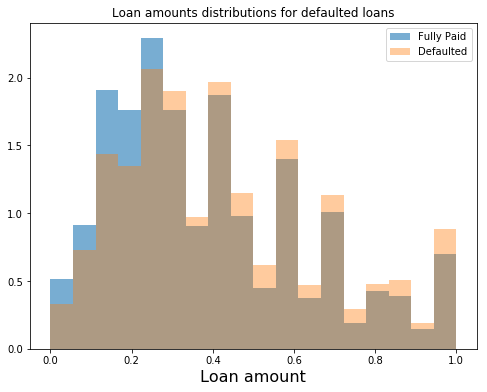
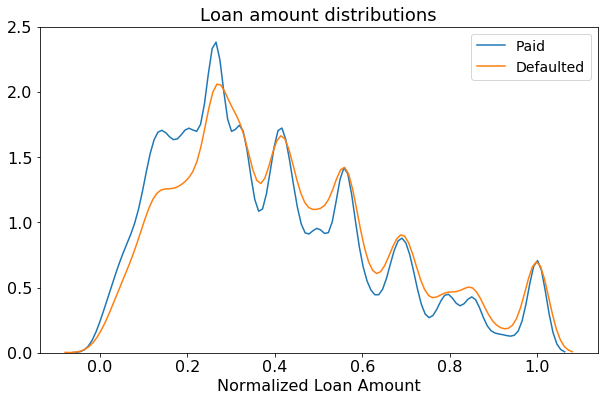
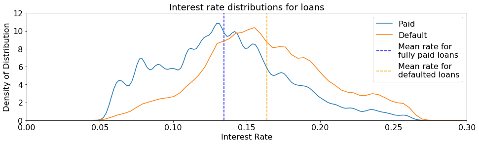

```python
import numpy as np
import pandas as pd
import datetime
from sklearn import preprocessing
pd.set_option('display.max_columns', 500)


import matplotlib
import matplotlib.pyplot as plt
%matplotlib inline
import seaborn as sns
```


```python
#read in lipika's cleaned training data
training_data = pd.read_csv("../lipika/cleaned_2013_14", delimiter=',');
print(training_data.shape);
```


    (351757, 50)


<div>
<style scoped>
    .dataframe tbody tr th:only-of-type {
        vertical-align: middle;
    }

    .dataframe tbody tr th {
        vertical-align: top;
    }

    .dataframe thead th {
        text-align: right;
    }
</style>
<table border="1" class="dataframe">
  <thead>
    <tr style="text-align: right;">
      <th></th>
      <th>funded_amnt</th>
      <th>int_rate</th>
      <th>total_pymnt</th>
      <th>annual_inc</th>
      <th>dti</th>
      <th>loan_status</th>
      <th>revol_util</th>
      <th>term</th>
      <th>term_adj</th>
      <th>zip_code</th>
      <th>emp_length_1 year</th>
      <th>emp_length_10+ years</th>
      <th>emp_length_2 years</th>
      <th>emp_length_3 years</th>
      <th>emp_length_4 years</th>
      <th>emp_length_5 years</th>
      <th>emp_length_6 years</th>
      <th>emp_length_7 years</th>
      <th>emp_length_8 years</th>
      <th>emp_length_9 years</th>
      <th>emp_length_&lt; 1 year</th>
      <th>home_ownership_ANY</th>
      <th>home_ownership_MORTGAGE</th>
      <th>home_ownership_OWN</th>
      <th>home_ownership_RENT</th>
      <th>verification_status_Not Verified</th>
      <th>verification_status_Source Verified</th>
      <th>verification_status_Verified</th>
      <th>grade_A</th>
      <th>grade_B</th>
      <th>grade_C</th>
      <th>grade_D</th>
      <th>grade_E</th>
      <th>grade_F</th>
      <th>grade_G</th>
      <th>purpose_car</th>
      <th>purpose_credit_card</th>
      <th>purpose_debt_consolidation</th>
      <th>purpose_home_improvement</th>
      <th>purpose_house</th>
      <th>purpose_major_purchase</th>
      <th>purpose_medical</th>
      <th>purpose_moving</th>
      <th>purpose_other</th>
      <th>purpose_renewable_energy</th>
      <th>purpose_small_business</th>
      <th>purpose_vacation</th>
      <th>purpose_wedding</th>
      <th>amnt</th>
      <th>paid</th>
    </tr>
  </thead>
  <tbody>
    <tr>
      <th>0</th>
      <td>0.276471</td>
      <td>0.0699</td>
      <td>6611.69</td>
      <td>0.007336</td>
      <td>0.373093</td>
      <td>Charged Off</td>
      <td>0.316</td>
      <td>3.0</td>
      <td>3.000000</td>
      <td>937xx</td>
      <td>0.0</td>
      <td>0.0</td>
      <td>0.0</td>
      <td>0.0</td>
      <td>0.0</td>
      <td>0.0</td>
      <td>0.0</td>
      <td>0.0</td>
      <td>1.0</td>
      <td>0.0</td>
      <td>0.0</td>
      <td>0.0</td>
      <td>1.0</td>
      <td>0.0</td>
      <td>0.0</td>
      <td>1.0</td>
      <td>0.0</td>
      <td>0.0</td>
      <td>1.0</td>
      <td>0.0</td>
      <td>0.0</td>
      <td>0.0</td>
      <td>0.0</td>
      <td>0.0</td>
      <td>0.0</td>
      <td>0.0</td>
      <td>1.0</td>
      <td>0.0</td>
      <td>0.0</td>
      <td>0.0</td>
      <td>0.0</td>
      <td>0.0</td>
      <td>0.0</td>
      <td>0.0</td>
      <td>0.0</td>
      <td>0.0</td>
      <td>0.0</td>
      <td>0.0</td>
      <td>10400.0</td>
      <td>1</td>
    </tr>
    <tr>
      <th>1</th>
      <td>0.411765</td>
      <td>0.1239</td>
      <td>17392.37</td>
      <td>0.010004</td>
      <td>0.300825</td>
      <td>Fully Paid</td>
      <td>0.290</td>
      <td>5.0</td>
      <td>1.500000</td>
      <td>235xx</td>
      <td>0.0</td>
      <td>1.0</td>
      <td>0.0</td>
      <td>0.0</td>
      <td>0.0</td>
      <td>0.0</td>
      <td>0.0</td>
      <td>0.0</td>
      <td>0.0</td>
      <td>0.0</td>
      <td>0.0</td>
      <td>0.0</td>
      <td>0.0</td>
      <td>0.0</td>
      <td>1.0</td>
      <td>0.0</td>
      <td>1.0</td>
      <td>0.0</td>
      <td>0.0</td>
      <td>0.0</td>
      <td>1.0</td>
      <td>0.0</td>
      <td>0.0</td>
      <td>0.0</td>
      <td>0.0</td>
      <td>0.0</td>
      <td>0.0</td>
      <td>1.0</td>
      <td>0.0</td>
      <td>0.0</td>
      <td>0.0</td>
      <td>0.0</td>
      <td>0.0</td>
      <td>0.0</td>
      <td>0.0</td>
      <td>0.0</td>
      <td>0.0</td>
      <td>0.0</td>
      <td>15000.0</td>
      <td>0</td>
    </tr>
    <tr>
      <th>2</th>
      <td>0.195588</td>
      <td>0.1366</td>
      <td>2281.98</td>
      <td>0.006269</td>
      <td>0.870468</td>
      <td>Charged Off</td>
      <td>0.919</td>
      <td>3.0</td>
      <td>3.000000</td>
      <td>850xx</td>
      <td>0.0</td>
      <td>0.0</td>
      <td>0.0</td>
      <td>0.0</td>
      <td>0.0</td>
      <td>0.0</td>
      <td>0.0</td>
      <td>0.0</td>
      <td>0.0</td>
      <td>0.0</td>
      <td>1.0</td>
      <td>0.0</td>
      <td>0.0</td>
      <td>0.0</td>
      <td>1.0</td>
      <td>0.0</td>
      <td>1.0</td>
      <td>0.0</td>
      <td>0.0</td>
      <td>0.0</td>
      <td>1.0</td>
      <td>0.0</td>
      <td>0.0</td>
      <td>0.0</td>
      <td>0.0</td>
      <td>0.0</td>
      <td>0.0</td>
      <td>1.0</td>
      <td>0.0</td>
      <td>0.0</td>
      <td>0.0</td>
      <td>0.0</td>
      <td>0.0</td>
      <td>0.0</td>
      <td>0.0</td>
      <td>0.0</td>
      <td>0.0</td>
      <td>0.0</td>
      <td>7650.0</td>
      <td>1</td>
    </tr>
    <tr>
      <th>3</th>
      <td>0.252941</td>
      <td>0.1366</td>
      <td>9973.43</td>
      <td>0.008804</td>
      <td>0.645411</td>
      <td>Fully Paid</td>
      <td>0.594</td>
      <td>3.0</td>
      <td>0.333333</td>
      <td>077xx</td>
      <td>0.0</td>
      <td>1.0</td>
      <td>0.0</td>
      <td>0.0</td>
      <td>0.0</td>
      <td>0.0</td>
      <td>0.0</td>
      <td>0.0</td>
      <td>0.0</td>
      <td>0.0</td>
      <td>0.0</td>
      <td>0.0</td>
      <td>0.0</td>
      <td>0.0</td>
      <td>1.0</td>
      <td>0.0</td>
      <td>1.0</td>
      <td>0.0</td>
      <td>0.0</td>
      <td>0.0</td>
      <td>1.0</td>
      <td>0.0</td>
      <td>0.0</td>
      <td>0.0</td>
      <td>0.0</td>
      <td>0.0</td>
      <td>0.0</td>
      <td>1.0</td>
      <td>0.0</td>
      <td>0.0</td>
      <td>0.0</td>
      <td>0.0</td>
      <td>0.0</td>
      <td>0.0</td>
      <td>0.0</td>
      <td>0.0</td>
      <td>0.0</td>
      <td>0.0</td>
      <td>9600.0</td>
      <td>0</td>
    </tr>
    <tr>
      <th>4</th>
      <td>0.600735</td>
      <td>0.1559</td>
      <td>25512.20</td>
      <td>0.008110</td>
      <td>0.462366</td>
      <td>Fully Paid</td>
      <td>0.762</td>
      <td>5.0</td>
      <td>1.416667</td>
      <td>658xx</td>
      <td>0.0</td>
      <td>0.0</td>
      <td>0.0</td>
      <td>0.0</td>
      <td>0.0</td>
      <td>0.0</td>
      <td>1.0</td>
      <td>0.0</td>
      <td>0.0</td>
      <td>0.0</td>
      <td>0.0</td>
      <td>0.0</td>
      <td>0.0</td>
      <td>0.0</td>
      <td>1.0</td>
      <td>0.0</td>
      <td>1.0</td>
      <td>0.0</td>
      <td>0.0</td>
      <td>0.0</td>
      <td>0.0</td>
      <td>1.0</td>
      <td>0.0</td>
      <td>0.0</td>
      <td>0.0</td>
      <td>0.0</td>
      <td>1.0</td>
      <td>0.0</td>
      <td>0.0</td>
      <td>0.0</td>
      <td>0.0</td>
      <td>0.0</td>
      <td>0.0</td>
      <td>0.0</td>
      <td>0.0</td>
      <td>0.0</td>
      <td>0.0</td>
      <td>0.0</td>
      <td>21425.0</td>
      <td>0</td>
    </tr>
  </tbody>
</table>
</div>


## Plot distribution of loan amounts for Paid and Defaulted loans


```python
training_data.funded_amnt.max()
```


    1.0000000000000002


```python
fig = plt.figure(figsize=(8,6));
ax = plt.subplot(1,1,1);
f_size=16;

ax.set_xlabel('Loan amount', fontsize= f_size);
ax.set_title('Loan amounts distributions for defaulted loans')

ax.hist(training_data.loc[training_data.paid == 0, "funded_amnt"], bins=18, density=True, label='Fully Paid', alpha=0.6);
ax.hist(training_data.loc[training_data.paid == 1, "funded_amnt"], bins=18, density=True, label='Defaulted', alpha=0.4);


ax.legend(loc='best');

plt.show()
```





```python
fig = plt.figure(figsize=(10,6));
ax = plt.subplot(1,1,1);
fontsize= 16;

ax.tick_params(labelsize=fontsize);
ax.set_xlabel(xlabel="Normalized Loan Amount", fontsize=fontsize);
ax.set_title(label="Loan amount distributions", fontsize=18)
#plot the funded amount for loans that were paid back and those that defaulted
sns.kdeplot(data = training_data.loc[training_data.paid == 0, "funded_amnt"], label = "Paid", ax = ax);
sns.kdeplot(data = training_data.loc[training_data.paid == 1, "funded_amnt"], label = "Defaulted", ax = ax);
ax.legend(fontsize=14);

plt.show()
```


    /anaconda3/lib/python3.7/site-packages/scipy/stats/stats.py:1713: FutureWarning: Using a non-tuple sequence for multidimensional indexing is deprecated; use `arr[tuple(seq)]` instead of `arr[seq]`. In the future this will be interpreted as an array index, `arr[np.array(seq)]`, which will result either in an error or a different result.
      return np.add.reduce(sorted[indexer] * weights, axis=axis) / sumval





There is a slight left shift in the distribution for loans that were paid back, which could possibly be exploited for higher rates of return.


```python
training_data_gb = training_data.groupby(by='paid').agg({
    'int_rate':'mean'
})
training_data_gb
```


<div>
<style scoped>
    .dataframe tbody tr th:only-of-type {
        vertical-align: middle;
    }

    .dataframe tbody tr th {
        vertical-align: top;
    }

    .dataframe thead th {
        text-align: right;
    }
</style>
<table border="1" class="dataframe">
  <thead>
    <tr style="text-align: right;">
      <th></th>
      <th>int_rate</th>
    </tr>
    <tr>
      <th>paid</th>
      <th></th>
    </tr>
  </thead>
  <tbody>
    <tr>
      <th>0</th>
      <td>0.134458</td>
    </tr>
    <tr>
      <th>1</th>
      <td>0.163700</td>
    </tr>
  </tbody>
</table>
</div>


```python
fig = plt.figure(figsize=(16,4));
ax = plt.subplot(1,1,1);
f_size=16;

ax.set_xlabel('Interest Rate', fontsize= f_size);
ax.set_ylabel('Density of Distribution', fontsize= f_size);
ax.set_title('Interest rate distributions for loans', fontsize=18)
ax.set_xlim(left=0, right=0.3);
ax.set_ylim(bottom=0, top=12);
ax.tick_params(labelsize=f_size);


sns.kdeplot(training_data.loc[training_data.paid == 0, 'int_rate'], label='Paid', ax=ax);
ax.vlines(x=training_data_gb.int_rate[0], ymin=0, ymax=12, colors='b', linestyles='dashed', label="Mean rate for \nfully paid loans")

sns.kdeplot(training_data.loc[training_data.paid == 1, 'int_rate'], label='Default', ax=ax);
ax.vlines(x=training_data_gb.int_rate[1], ymin=0, ymax=12, colors='orange', linestyles='dashed', label="Mean rate for \ndefaulted loans")

ax.legend(loc='best', fontsize=f_size);

# plt.show()
# plt.savefig('Interest_rate_distrb_for_loans.png', bbox_inches='tight');
```


    /anaconda3/lib/python3.7/site-packages/scipy/stats/stats.py:1713: FutureWarning: Using a non-tuple sequence for multidimensional indexing is deprecated; use `arr[tuple(seq)]` instead of `arr[seq]`. In the future this will be interpreted as an array index, `arr[np.array(seq)]`, which will result either in an error or a different result.
      return np.add.reduce(sorted[indexer] * weights, axis=axis) / sumval





Interest rate could also be a good predictor of defaulted loans since the distribution of interest rates for paid back loans is shifted to the left compared to the distribution of interest rates for defaulted loans.
